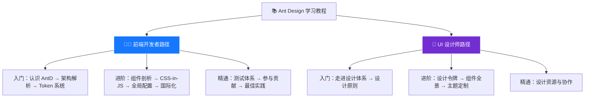

# 📚 Ant Design 源码学习教程

> 由浅入深，系统掌握 Ant Design 的设计理念、架构原理与源码实现。

## 🎯 教程简介

本教程针对**前端开发者**和 **UI 设计师**两种角色，分别提供了独立的学习路径。
教程通过拆解 Ant Design 源码仓库，帮助你：

- 理解企业级 UI 组件库的设计哲学
- 掌握 Design Token 主题系统的工作原理
- 学会 CSS-in-JS 样式架构的最佳实践
- 具备阅读和贡献开源项目的能力

---

## 🗺️ 学习路径总览

本教程分为两条独立路径，请根据你的角色选择对应的目录：



---

## 🧑‍💻 前端开发者路径

> 侧重源码实现、架构设计、工程化实践，共 10 章。

📂 目录：[`learn/front-end/`](./front-end/)

| 序号 | 章节 | 内容概要 |
|------|------|----------|
| 01 | [认识 Ant Design](./front-end/01-introduction.md) | 设计理念、核心价值、生态系统 |
| 02 | [仓库架构解析](./front-end/02-architecture.md) | 目录结构、技术栈、构建流程 |
| 03 | [设计令牌系统](./front-end/03-design-tokens.md) | Token 四级层级、主题定制、暗色/紧凑模式 |
| 04 | [组件剖析](./front-end/04-component-anatomy.md) | 以 Button 为例深入分析组件实现 |
| 05 | [CSS-in-JS 样式系统](./front-end/05-cssinjs-styling.md) | 样式架构、生成流程、自定义样式 |
| 06 | [全局配置系统](./front-end/06-config-provider.md) | ConfigProvider、主题、组件默认配置 |
| 07 | [国际化系统](./front-end/07-i18n.md) | 多语言支持原理与实践 |
| 08 | [测试体系](./front-end/08-testing.md) | 测试策略、单元/快照/视觉回归测试 |
| 09 | [参与贡献指南](./front-end/09-contributing.md) | 开发环境、提交规范、PR 流程 |
| 10 | [最佳实践与进阶](./front-end/10-best-practices.md) | 性能优化、按需加载、SSR、常见问题 |

---

## 🎨 UI 设计师路径

> 侧重设计系统、Token 体系、主题定制，共 6 章。

📂 目录：[`learn/ui-designer/`](./ui-designer/)

| 序号 | 章节 | 内容概要 |
|------|------|----------|
| 01 | [走进 Ant Design 设计体系](./ui-designer/01-introduction.md) | 什么是设计系统、Ant Design 的定位 |
| 02 | [设计原则深度解读](./ui-designer/02-design-principles.md) | 自然、确定性、意义感、生长性 |
| 03 | [设计令牌（Design Token）](./ui-designer/03-design-tokens.md) | Token 体系与设计工具的对应关系 |
| 04 | [组件使用全景图](./ui-designer/04-component-guide.md) | 80+ 组件分类、使用场景、设计规范 |
| 05 | [主题定制实战](./ui-designer/05-theme-customization.md) | 品牌色换肤、暗色模式、紧凑模式 |
| 06 | [设计资源与协作](./ui-designer/06-design-resources.md) | Figma 资源、设计师与开发者协作 |

---

## 📋 前置知识

### 前端开发者需要

- ✅ HTML / CSS / JavaScript 基础
- ✅ React 基础（Hooks、Context、Ref）
- ✅ TypeScript 基础
- ✅ npm / Node.js 基本使用

### UI 设计师需要

- ✅ 了解设计系统概念（Design System）
- ✅ 了解基本的前端术语（组件、属性、样式等）
- ⬜ TypeScript / React 知识（非必须，教程中会解释）

---

## 🚀 快速开始

```bash
# 1. 克隆仓库
git clone https://github.com/ant-design/ant-design.git
cd ant-design

# 2. 安装依赖
npm install

# 3. 启动开发服务器
npm start

# 4. 运行测试
npm test

# 5. 打开浏览器访问
# http://localhost:8000
```

---

## 💡 阅读建议

1. **选择路径**：根据自己的角色进入对应的目录，不需要两条路径都读
2. **循序渐进**：按照编号顺序阅读，每一章都建立在前一章的基础上
3. **动手实践**：每章都有代码示例或操作指引，建议跟着做一遍
4. **对照源码**：教程会标注源码路径，建议同步打开源码对照阅读
5. **带着问题学**：每章末尾有思考题，帮助加深理解

---

> 📝 本教程基于 Ant Design v5.x 源码编写，如有版本差异请以实际源码为准。
