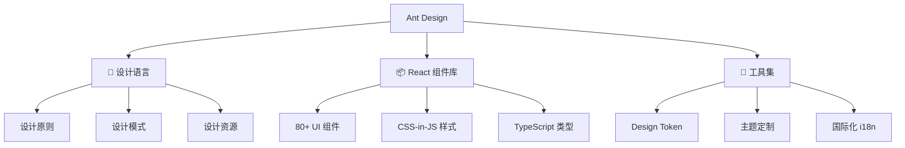
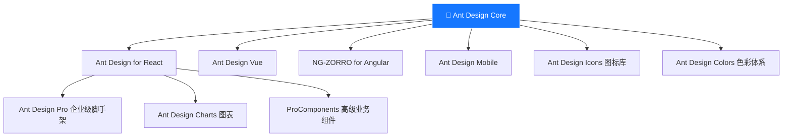
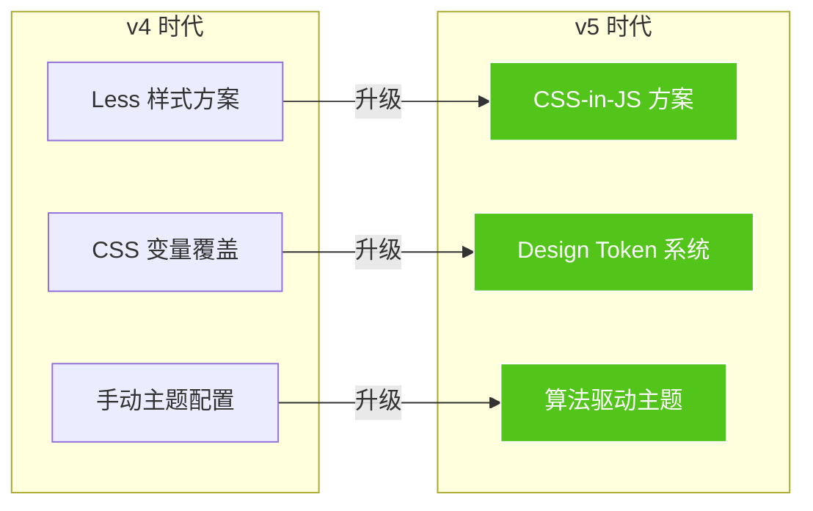

# 01 🌟 认识 Ant Design

> 从零开始，了解 Ant Design 是什么、为什么要用它、以及它的设计哲学。

---

## 📌 本章目标

- 理解 Ant Design 的定位和核心价值
- 了解 Ant Design 的设计原则
- 认识 Ant Design 的生态系统
- 了解 v5 的重大技术升级

---

## 1.1 什么是 Ant Design？

### 一句话定义

> Ant Design 是蚂蚁集团出品的**企业级 UI 设计语言和 React 组件库**。

### 通俗理解

想象你在盖一栋大楼 🏢：

- **设计语言** = 建筑设计图纸（规定窗户多大、门多宽、楼梯怎么放）
- **组件库** = 预制件仓库（标准的窗户、门、楼梯，直接搬来用）
- **Ant Design** = 设计图纸 + 预制件仓库的组合

不用每次都从零画图纸、造预制件，直接用标准化的方案，既能保证质量，又能加快速度。

### 核心组成



---

## 1.2 为什么选择 Ant Design？

### 🎯 解决的核心问题

| 问题 | 没有 Ant Design | 有了 Ant Design |
|------|-----------------|-----------------|
| UI 一致性 | 每个开发者写的按钮长得都不一样 | 统一的视觉规范 |
| 开发效率 | 每个表单、表格都要从头写 | 80+ 开箱即用的组件 |
| 交互体验 | 各种交互细节容易遗漏 | 经过千锤百炼的交互方案 |
| 主题定制 | 改颜色要改几百个地方 | Design Token 一键换肤 |
| 国际化 | 每个文案都要手动翻译 | 内置 75+ 语言支持 |
| 可访问性 | 容易忽略无障碍需求 | 内置 WCAG 2.1 AA 标准支持 |

### 🆚 与其他组件库对比

| 特点 | Ant Design | Material UI | Element Plus |
|------|-----------|-------------|--------------|
| 框架 | React | React | Vue |
| 定位 | 企业级中后台 | 通用 | 企业级中后台 |
| 组件数 | 80+ | 50+ | 70+ |
| 主题系统 | Design Token | Theme API | CSS Variables |
| 样式方案 | CSS-in-JS | Emotion | CSS/SCSS |
| TypeScript | ✅ 原生 | ✅ 原生 | ✅ 原生 |
| 国际化 | 75+ 语言 | 50+ 语言 | 60+ 语言 |

---

## 1.3 设计原则

Ant Design 遵循 4 个核心设计原则，它们贯穿了整个组件库的设计和实现：

### 🌊 自然（Natural）

> 像水一样自然流淌，用户不需要"学习"如何使用。

**代码体现**：按钮的点击波纹效果（Wave），让用户获得即时反馈。

```
源码位置：components/_util/wave/index.tsx
```

点击按钮时，一个 `WaveEffect` 组件会在按钮位置创建一个扩散动画，给用户"我点到了"的直觉反馈。这比只改变颜色更自然。

### ⚡ 确定性（Certain）

> 消除模棱两可，给用户明确的预期。

**代码体现**：颜色的语义化设计。

```typescript
// 源码：components/theme/themes/seed.ts
colorPrimary: '#1677ff',    // 主操作 — 蓝色
colorSuccess: '#52c41a',    // 成功 — 绿色
colorWarning: '#faad14',    // 警告 — 橙色
colorError: '#ff4d4f',      // 错误 — 红色
```

颜色不是随便选的，每种颜色都有明确的语义。就像红绿灯 🚦 — 红灯停、绿灯行，没有歧义。

### 🎯 意义感（Meaningful）

> 每个设计元素都有存在的理由。

**代码体现**：Button 的 5 种类型，各有明确使用场景。

```tsx
<Button type="primary">主操作（一个页面最多一个）</Button>
<Button>次要操作（默认按钮）</Button>
<Button type="dashed">添加操作（虚线边框暗示"可增加"）</Button>
<Button type="text">最低优先级操作（纯文字）</Button>
<Button type="link">链接操作（跳转用途）</Button>
```

### 🌍 生长性（Growing）

> 设计系统能够持续演进、适应变化。

**代码体现**：Design Token 的四级传播机制。

```
只需修改 colorPrimary → 自动影响 500+ 个样式变量 → 所有组件自动更新
```

就像乐高积木 🧱 — 基础模块简单标准，但可以组合出无穷变化。

---

## 1.4 生态系统

Ant Design 不是孤立的，它是一个庞大生态系统的核心：



| 项目 | 说明 | 适用场景 |
|------|------|----------|
| **Ant Design** | 核心组件库 | 通用 Web 应用 |
| **Ant Design Pro** | 企业级脚手架 | 中后台快速搭建 |
| **ProComponents** | 高级业务组件 | 复杂表单、表格 |
| **Ant Design Mobile** | 移动端组件 | H5 / 混合应用 |
| **Ant Design Charts** | 数据可视化 | 图表、报表 |

---

## 1.5 v5 的重大技术变革

从 v4 到 v5，Ant Design 经历了一次"技术换心"：



| 改变 | 为什么 | 好处 |
|------|--------|------|
| Less → CSS-in-JS | Less 需要编译工具支持，无法在运行时动态修改 | 运行时换肤，无需额外配置 |
| CSS 变量 → Design Token | CSS 变量缺乏层级关系和语义 | Token 有清晰的层级，修改一处自动传播 |
| 手动配置 → 算法驱动 | 手动配置暗色主题要改几百个颜色 | 算法自动计算，只需指定少量种子 Token |

---

## 1.6 核心数据一览

| 维度 | 数据 |
|------|------|
| ⭐ GitHub Stars | 90,000+ |
| 📦 组件数量 | 80+ |
| 🌍 支持语言 | 75+ |
| 🎨 Design Token | 500+ |
| 📝 TypeScript | 100% 类型覆盖 |
| 👥 贡献者 | 2,500+ |

---

## 🤔 思考题

1. 如果你要开发一个内部管理系统，为什么选择 Ant Design 而不是自己写组件？
2. Design Token 相比传统的 CSS 变量，优势在哪里？
3. "自然"这个设计原则，你能在日常使用的 App 中找到类似的例子吗？

---

> [返回目录](./README.md) | ➡️ [下一章：仓库架构解析](./02-architecture.md)
