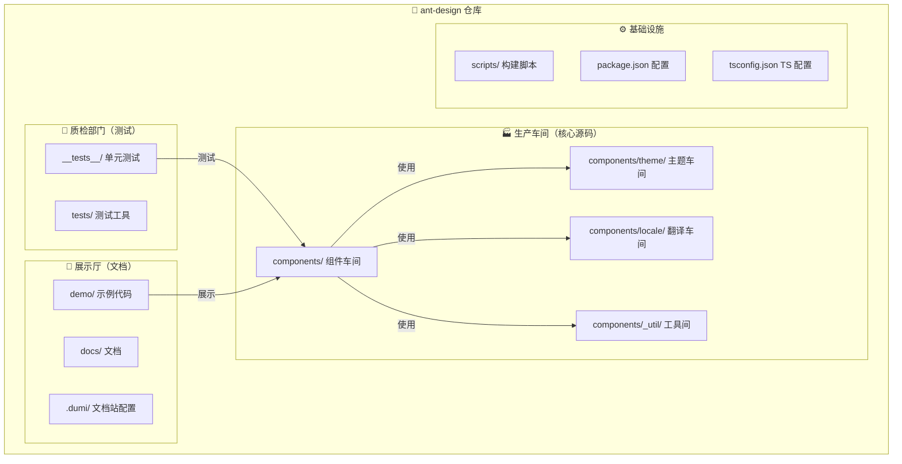
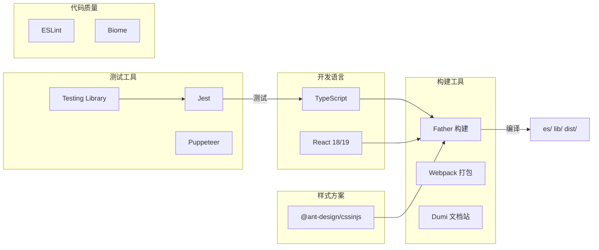
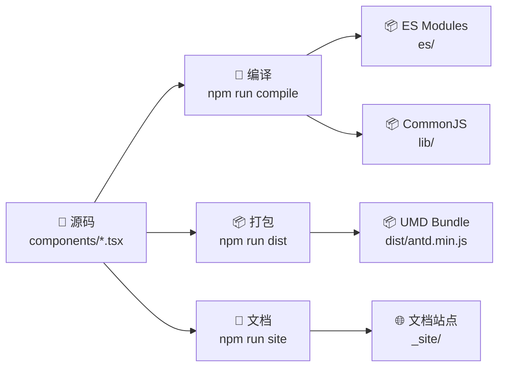
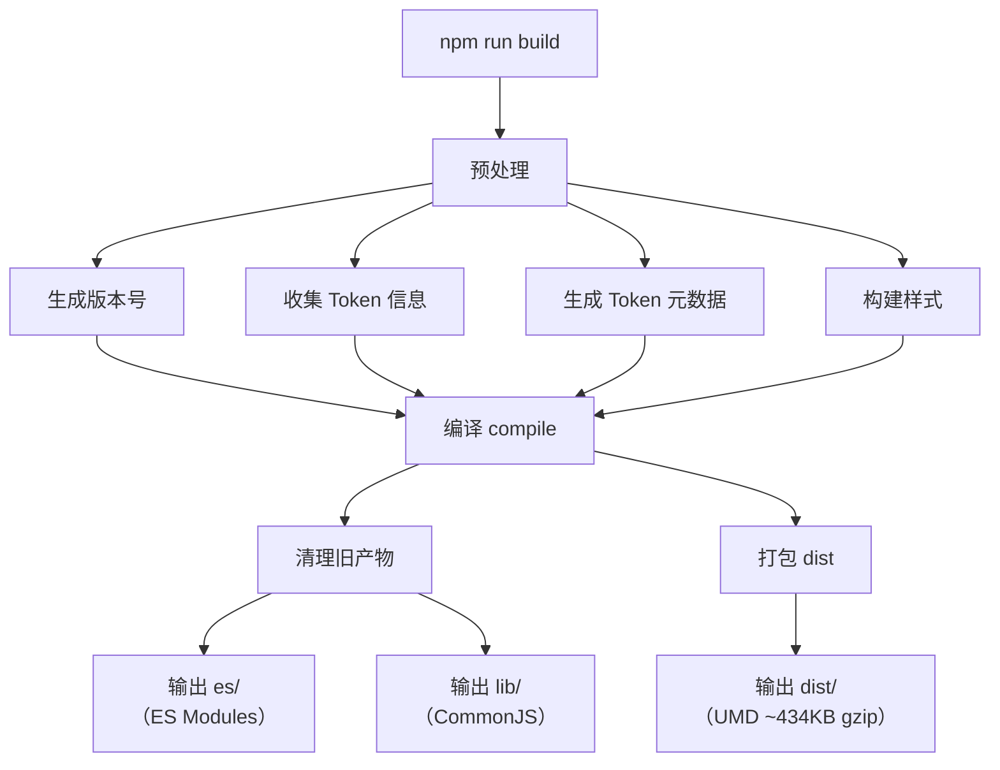
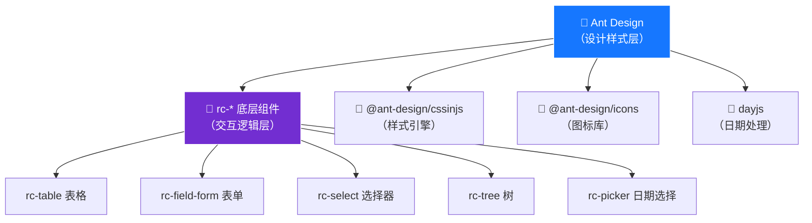

# 02 🏗️ 仓库架构解析

> 打开 Ant Design 源码仓库的"建筑图纸"，理解每个目录的职责和整体架构设计。

---

## 📌 本章目标

- 掌握 Ant Design 仓库的目录结构
- 理解各模块之间的依赖关系
- 了解构建流程和产物
- 认识核心技术栈

---

## 2.1 整体架构概览

把 Ant Design 想象成一个**工厂** 🏭，它的架构就像工厂的车间分布：



---

## 2.2 目录结构详解

### 顶层目录

```
ant-design/
├── 📁 components/          # ⭐ 核心：所有组件源码
├── 📁 docs/                # 网站文档页面
├── 📁 tests/               # 共享测试工具和配置
├── 📁 scripts/             # 构建和自动化脚本
├── 📁 .dumi/               # 文档站点（Dumi）配置
├── 📁 public/              # 静态资源文件
├── 📄 package.json         # 依赖和脚本配置
├── 📄 tsconfig.json        # TypeScript 配置
├── 📄 .dumirc.ts           # Dumi 文档工具配置
├── 📄 .fatherrc.ts         # Father 构建工具配置
├── 📄 .eslintrc.mjs        # ESLint 代码检查配置
├── 📄 biome.json           # Biome 格式化配置
└── 📄 .jest.js             # Jest 测试框架配置
```

### 核心：`components/` 目录

这是整个仓库最重要的目录，包含了 80+ 个组件：

```
components/
├── 📁 button/              # 按钮组件
├── 📁 input/               # 输入框组件
├── 📁 table/               # 表格组件
├── 📁 form/                # 表单组件
├── 📁 modal/               # 对话框组件
├── 📁 ... (80+ 组件)       # 更多组件
│
├── 📁 theme/               # 🎨 主题系统（Design Token）
├── 📁 locale/              # 🌍 国际化语言包
├── 📁 _util/               # 🔧 共享工具函数
├── 📁 style/               # 💅 全局基础样式
├── 📁 config-provider/     # ⚙️ 全局配置组件
│
├── 📁 __tests__/           # 跨组件测试
├── 📄 index.ts             # 统一导出入口
└── 📁 version/             # 版本信息
```

### 单个组件目录结构（以 Button 为例）

每个组件就像一个"迷你项目"，有着统一的目录结构：

```
button/
├── 📄 Button.tsx              # 🎯 主组件实现（核心逻辑）
├── 📄 ButtonGroup.tsx         # 子组件（按钮组）
├── 📄 buttonHelpers.tsx       # 辅助函数（类型定义、工具）
├── 📄 index.tsx               # 导出入口
│
├── 📁 style/                  # 💅 样式目录
│   ├── index.ts              # 样式主入口（genStyleHooks）
│   ├── token.ts              # 组件专属 Token 定义
│   ├── variant.ts            # 变体样式（solid/outlined/dashed...）
│   ├── group.ts              # ButtonGroup 样式
│   └── compact.ts            # 紧凑模式样式
│
├── 📁 demo/                   # 📖 示例目录
│   ├── basic.tsx             # 基础示例代码
│   ├── basic.md              # 示例说明（中英双语）
│   ├── block.tsx             # 块级按钮示例
│   └── ...                   # 更多示例
│
├── 📁 __tests__/              # 🧪 测试目录
│   ├── index.test.tsx        # 主测试文件
│   ├── a11y.test.ts          # 可访问性测试
│   └── __snapshots__/        # 快照文件
│
├── 📄 index.en-US.md         # 📝 英文 API 文档
└── 📄 index.zh-CN.md         # 📝 中文 API 文档
```

#### 为什么这样设计？

| 设计决策 | 原因 |
|---------|------|
| 每个组件一个目录 | **高内聚**：组件相关的一切都在同一个地方，找代码不用满仓库翻 |
| 样式独立 `style/` 目录 | 样式代码量大，分离便于维护；也方便 tree-shaking 按需加载 |
| 示例放在 `demo/` | Dumi 工具自动扫描并生成文档页面，无需手动配置路由 |
| 测试放在 `__tests__/` | Jest 默认约定，测试发现零配置 |
| 双语 `.md` 文档 | 面向国际用户，中英文分文件管理，互不干扰 |

---

## 2.3 技术栈全景



### 为什么选择这些技术？

| 技术 | 为什么选它 | 通俗理解 |
|------|-----------|----------|
| **TypeScript** | 类型安全，减少 Bug | 像给代码加了"拼写检查"，写错属性名立即提示 |
| **CSS-in-JS** | 运行时动态样式，支持主题切换 | 像"活的"CSS，能根据场景自动变化 |
| **Father** | 蚂蚁出品的组件库构建工具 | 专门为"造组件库"定制的流水线 |
| **Dumi** | 组件文档自动生成 | 写了代码就自动有了文档网站 |
| **Jest** | 最流行的 JS 测试框架 | 像"质检员"，保证每个组件都没问题 |
| **Biome** | 快速代码格式化和检查 | 像"书法老师"，保证代码风格统一 |

---

## 2.4 构建流程

### 从源码到发布包



### 三种输出格式

Ant Design 编译后输出三种格式，满足不同使用场景：

| 格式 | 目录 | 用途 | 场景 |
|------|------|------|------|
| **ES Modules** | `es/` | 现代打包工具 | Webpack/Vite 项目，支持 tree-shaking |
| **CommonJS** | `lib/` | Node.js / 旧项目 | SSR 服务端渲染、旧的构建系统 |
| **UMD** | `dist/` | 浏览器直接引用 | CDN 引入、简单原型项目 |

**通俗理解**：就像一本书出版三种版本 📚
- **ES Modules** = 电子书（可以搜索、按需阅读某一章）
- **CommonJS** = 精装书（传统版本，在各种书架上都能放）
- **UMD** = 单页海报（直接贴在墙上就能看）

### 完整构建流程



---

## 2.5 依赖关系

### `rc-*` 底层组件

Ant Design 的组件不是从零开始的，而是基于 `rc-*`（React Component）底层组件构建：



**通俗理解**：

```
Ant Design 组件 = rc-* 底层组件（骨架） + 样式（皮肤） + 主题（配色）
```

就像汽车制造 🚗：
- `rc-*` = 底盘和发动机（核心机械结构）
- Ant Design = 完整的汽车（加了车壳、内饰、涂装）

**为什么要分层？**

1. **复用**：`rc-*` 不仅 Ant Design 用，Ant Design Vue 的部分逻辑也可以共用
2. **关注点分离**：`rc-*` 只关心交互逻辑（键盘导航、选中状态），Ant Design 只关心视觉样式
3. **降低复杂度**：复杂组件（如 Table、Select）的交互逻辑本身就非常复杂，单独维护更容易管理

---

## 2.6 关键配置文件

### `package.json` 核心字段

```jsonc
{
  "name": "antd",
  
  // 三种模块入口 — 让不同工具链找到正确的文件
  "main": "lib/index.js",        // CommonJS（require）
  "module": "es/index.js",       // ES Modules（import）
  "unpkg": "dist/antd.min.js",   // CDN（<script> 标签）
  "typings": "es/index.d.ts",    // TypeScript 类型入口
  
  // 发布到 npm 的文件（只发必要的，减小安装体积）
  "files": ["dist", "es", "lib", "locale"]
}
```

### 组件导出入口 `components/index.ts`

```typescript
// 所有组件从这里统一导出
export { default as Button } from './button';
export type { ButtonProps } from './button';

export { default as Input } from './input';
export type { InputProps } from './input';

export { default as Table } from './table';
export type { TableProps } from './table';

// ... 80+ 组件
```

**为什么需要统一导出？**

```tsx
// ✅ 用户这样导入（简单直观）
import { Button, Input, Table } from 'antd';

// ❌ 而不是这样（麻烦且路径不稳定）
import Button from 'antd/es/components/button/Button';
```

---

## 2.7 文档系统

### Demo 是怎样变成在线示例的？

**Step 1**：在 `demo/` 下写 `.tsx` 文件：

```tsx
// components/button/demo/basic.tsx
import React from 'react';
import { Button, Flex } from 'antd';

const App: React.FC = () => (
  <Flex gap="small" wrap>
    <Button type="primary">Primary Button</Button>
    <Button>Default Button</Button>
  </Flex>
);

export default App;
```

**Step 2**：写配套 `.md` 描述文件：

```markdown
<!-- components/button/demo/basic.md -->
## zh-CN
按钮有五种类型：主按钮、默认按钮、虚线按钮、文本按钮和链接按钮。

## en-US
There are `primary` button, default button, `dashed` button, `text` button and `link` button.
```

**Step 3**：Dumi 自动扫描文件 → 生成路由 → 渲染 Demo → 展示代码 → 生成文档

> 开发者只需要写好组件和示例代码，文档网站就自动生成了！

---

## 🤔 思考题

1. 为什么 Ant Design 要输出三种格式（ES Module / CommonJS / UMD）？哪种支持 tree-shaking？
2. `rc-*` 底层组件和 Ant Design 组件的关系是什么？如果去掉 `rc-*`，直接在 Ant Design 中写交互逻辑，会有什么问题？
3. 每个组件目录为什么要包含 `demo/`、`style/`、`__tests__/`？如果把它们集中放在仓库根目录会怎样？

---

> ⬅️ [上一章：认识 Ant Design](./01-introduction.md) | [返回目录](./README.md) | ➡️ [下一章：设计令牌系统](./03-design-tokens.md)
