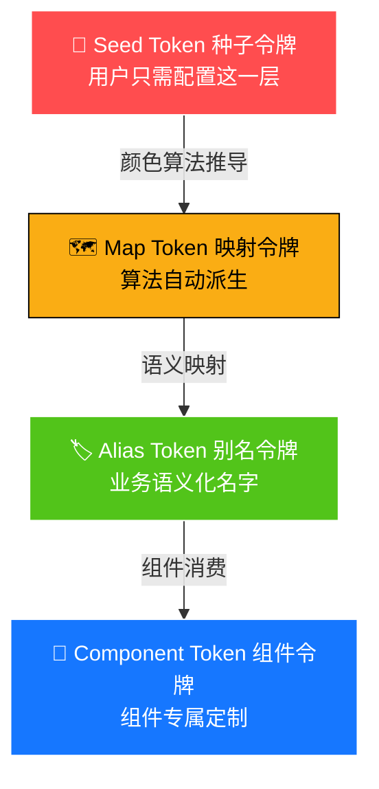
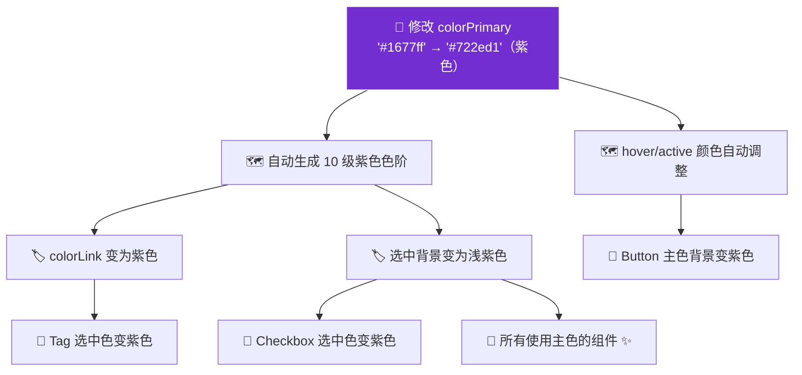
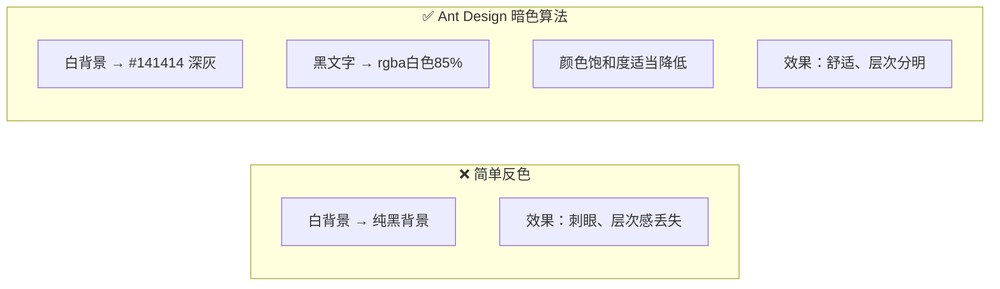
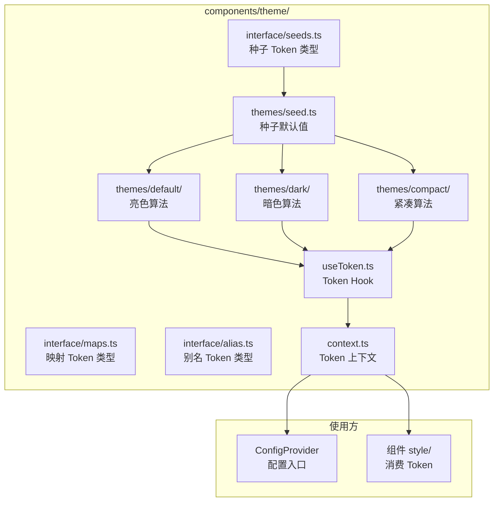

# 03 🎨 设计令牌系统（Design Token）

> 理解 Ant Design 主题系统的核心 — Design Token，掌握"一键换肤"的秘密。

---

## 📌 本章目标

- 理解 Design Token 的概念和价值
- 掌握 Token 的四级层级体系
- 学会使用 Token 自定义主题
- 了解暗色模式和紧凑模式的实现原理

---

## 3.1 什么是 Design Token？

### 通俗理解

想象你在装修房子 🏠：

- **传统方式**：客厅墙壁用 `#1677ff`，卧室门框用 `#1677ff`，浴室瓷砖用 `#1677ff`... 如果想换颜色？每个地方都要改！
- **Design Token 方式**：定义一个"主色调"变量，所有地方都引用这个变量。想换颜色？改一处，全屋自动变！

```
传统方式：     按钮(#1677ff) + 链接(#1677ff) + 标签(#1677ff)   ← 改颜色要改 3 处

Token 方式：   colorPrimary = '#1677ff'
                ├── 按钮(colorPrimary)
                ├── 链接(colorPrimary)     ← 改颜色只改 1 处
                └── 标签(colorPrimary)
```

### 官方定义

> Design Token 是一组描述设计系统视觉属性的**命名变量**，包括颜色、字体、间距、圆角、动画等。

---

## 3.2 Token 四级层级体系

这是 Ant Design Token 系统最精妙的设计 — **四级梯度传播**：



### 🌱 第一级：Seed Token（种子令牌）

> 你只需要设定**几颗种子**，整棵主题大树就能自动生长。

**源码位置**：`components/theme/themes/seed.ts`

```typescript
const seedToken = {
  // 品牌色 — 改这一个，所有主色调自动变
  colorPrimary: '#1677ff',
  
  // 功能色
  colorSuccess: '#52c41a',   // 成功：绿色
  colorWarning: '#faad14',   // 警告：橙色
  colorError: '#ff4d4f',     // 错误：红色
  colorInfo: '#1677ff',      // 信息：蓝色
  
  fontSize: 14,              // 基础字体大小
  borderRadius: 6,           // 基础圆角
  controlHeight: 32,         // 控件高度
  sizeUnit: 4,               // 间距单位
  wireframe: false,          // 是否线框风格
  motion: true,              // 是否启用动画
};
```

**通俗理解**：种子令牌就像种子 🌰 — 你种下一颗"蓝色"的种子（`colorPrimary: '#1677ff'`），系统会自动长出整棵蓝色系的树（按钮是蓝色、链接是蓝色、选中项是蓝色...）。

### 🗺️ 第二级：Map Token（映射令牌）

> 从种子令牌通过**算法自动计算**出的衍生值。

一颗 `colorPrimary: '#1677ff'` 种子，会自动生成 10 级色阶：

```
种子色 #1677ff 的 10 级色阶：

1  ██████ #e6f4ff  （极淡 — 用于背景）
2  ██████ #bae0ff  （很淡 — hover 背景）
3  ██████ #91caff  （淡   — 边框）
4  ██████ #69b1ff  （浅   — hover 边框）
5  ██████ #4096ff  （中浅 — hover 主色）
6  ██████ #1677ff  （标准 — 主色 ⬅️ 种子值）
7  ██████ #0958d9  （中深 — active 主色）
8  ██████ #003eb3  （深）
9  ██████ #002c8c  （很深）
10 ██████ #001d66  （极深）
```

**通俗理解**：就像画水彩画 🎨 — 你给一滴蓝色颜料加不同量的水，得到从浅到深的 10 个蓝色。算法就是那个"加水的规则"。

**对应的代码**：

```typescript
// 算法自动生成的 Map Token
{
  colorPrimaryBg: '#e6f4ff',         // 色阶 1 — 最浅背景
  colorPrimaryBgHover: '#bae0ff',    // 色阶 2
  colorPrimaryBorder: '#91caff',     // 色阶 3 — 边框
  colorPrimaryBorderHover: '#69b1ff',// 色阶 4
  colorPrimaryHover: '#4096ff',      // 色阶 5 — hover
  colorPrimary: '#1677ff',           // 色阶 6 — 种子值
  colorPrimaryActive: '#0958d9',     // 色阶 7 — active
  colorPrimaryTextHover: '#4096ff',  // 色阶 8
  colorPrimaryText: '#1677ff',       // 色阶 9
  colorPrimaryTextActive: '#0958d9', // 色阶 10
}
```

### 🏷️ 第三级：Alias Token（别名令牌）

> 给 Map Token 起**业务语义化的名字**。

```typescript
{
  // 背景色 — 不叫 "white" 而叫 "容器背景色"
  colorBgContainer: '#ffffff',
  colorBgElevated: '#ffffff',      // 浮层背景
  colorBgLayout: '#f5f5f5',        // 页面布局背景
  
  // 文字色 — 语义化命名
  colorText: 'rgba(0, 0, 0, 0.88)',          // 主要文字
  colorTextSecondary: 'rgba(0, 0, 0, 0.65)', // 次要文字
  colorTextTertiary: 'rgba(0, 0, 0, 0.45)',  // 三级文字
  colorTextQuaternary: 'rgba(0, 0, 0, 0.25)',// 四级文字（占位符）
  
  // 间距
  padding: 16,
  paddingSM: 12,
  paddingLG: 24,
  paddingXS: 8,
}
```

**为什么需要别名？**

```
❌ 没有别名：开发者需要记住 "colorPrimary1 用于浅背景，colorPrimary3 用于边框..."
✅ 有了别名：colorBgContainer → "容器的背景色" — 名字即用途，一看就懂
```

### 🧩 第四级：Component Token（组件令牌）

> 每个组件的**专属定制变量**。

**源码位置**：`components/button/style/token.ts`

```typescript
// Button 组件专属 Token（节选）
interface ButtonToken {
  fontWeight: number;           // 字体粗细
  primaryColor: string;         // 主要按钮文字色
  defaultColor: string;         // 默认按钮文字色
  defaultBg: string;            // 默认按钮背景色
  defaultBorderColor: string;   // 默认按钮边框色
  primaryShadow: string;        // 主要按钮阴影
  dangerShadow: string;         // 危险按钮阴影
  // ... 100+ Button 专属 Token
}
```

**通俗理解**：前三级 Token 是"全局规则"，Component Token 是"个性化定制"。就像公司有统一的着装规范（Alias Token），但销售部可以在规范内选择不同颜色的领带（Component Token）。

---

## 3.3 Token 传播机制

完整示例 — 当你修改 `colorPrimary` 时，发生了什么？



> 改一个值，影响 500+ 个样式变量，所有组件自动更新。这就是 Token 系统的威力！

---

## 3.4 主题定制实战

### 基础主题定制

```tsx
import { ConfigProvider } from 'antd';

function App() {
  return (
    <ConfigProvider
      theme={{
        token: {
          // 🌱 修改种子 Token — 全局生效
          colorPrimary: '#722ed1',  // 品牌色改为紫色
          borderRadius: 8,           // 圆角加大
          fontSize: 16,              // 字体加大
        },
      }}
    >
      <MyApp />
    </ConfigProvider>
  );
}
```

### 组件级定制

```tsx
<ConfigProvider
  theme={{
    components: {
      // 🧩 只改 Button
      Button: {
        colorPrimary: '#ff4d4f',    // Button 主色改为红色
        borderRadius: 20,            // Button 用大圆角
      },
      // 🧩 只改 Input
      Input: {
        colorPrimary: '#52c41a',    // Input 聚焦时用绿色
      },
    },
  }}
>
  <MyApp />
</ConfigProvider>
```

### 暗色模式

```tsx
import { ConfigProvider, theme } from 'antd';

<ConfigProvider
  theme={{
    algorithm: theme.darkAlgorithm,  // 一行代码切换暗色
  }}
>
  <MyApp />
</ConfigProvider>
```

### 紧凑模式

```tsx
<ConfigProvider
  theme={{
    algorithm: theme.compactAlgorithm,  // 紧凑模式
  }}
>
  <MyApp />
</ConfigProvider>
```

### 组合算法

```tsx
<ConfigProvider
  theme={{
    // 暗色 + 紧凑，多算法组合
    algorithm: [theme.darkAlgorithm, theme.compactAlgorithm],
  }}
>
  <MyApp />
</ConfigProvider>
```

---

## 3.5 暗色模式原理

### 暗色不是简单的"反色"



**源码位置**：`components/theme/themes/dark/`

```typescript
// 暗色模式的关键变化
{
  // 背景用深灰而非纯黑（降低对比度疲劳）
  colorBgContainer: '#141414',
  colorBgElevated: '#1f1f1f',
  
  // 文字用半透明白（避免刺眼）
  colorText: 'rgba(255, 255, 255, 0.85)',
  colorTextSecondary: 'rgba(255, 255, 255, 0.65)',
}
```

**为什么背景用 `#141414` 而不是 `#000000`？**

> 纯黑 + 白字 = 极高对比度 = 长时间看眼睛累。
> 深灰稍微降低对比度，阅读更舒适。这遵循了 Material Design 和 Apple HIG 的暗色模式最佳实践。

---

## 3.6 Token 系统源码架构



**`useToken` 的核心逻辑**（源码：`components/theme/useToken.ts`）：

```typescript
export default function useToken() {
  // 1. 从 Context 获取用户配置的 Token
  const { token, theme, override, cssVar } = useContext(DesignTokenContext);
  
  // 2. 合并默认 Token 和用户 Token
  // 3. 通过算法（亮色/暗色/紧凑）计算最终 Token
  // 4. 利用缓存机制避免重复计算
  const [mergedToken, hashId] = useCacheToken(
    mergedTheme,
    [defaultSeedToken, rootDesignToken],
    { salt, override, getComputedToken }
  );
  
  return [mergedTheme, mergedToken, hashId];
}
```

---

## 🤔 思考题

1. 如果只要改品牌色，需要改几个 Token？为什么 Token 要分四级而不是平铺？
2. 暗色模式为什么不能简单地"黑白反转"？
3. 如果你的项目需要同时支持多个品牌的主题（比如一个 SaaS 平台给不同客户定制颜色），Design Token 系统怎样帮助你？

---

> ⬅️ [上一章：仓库架构解析](./02-architecture.md) | [返回目录](./README.md) | ➡️ [下一章：组件剖析](./04-component-anatomy.md)
