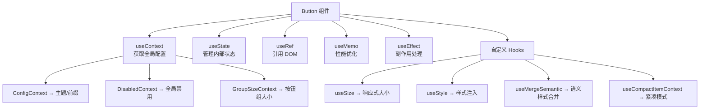
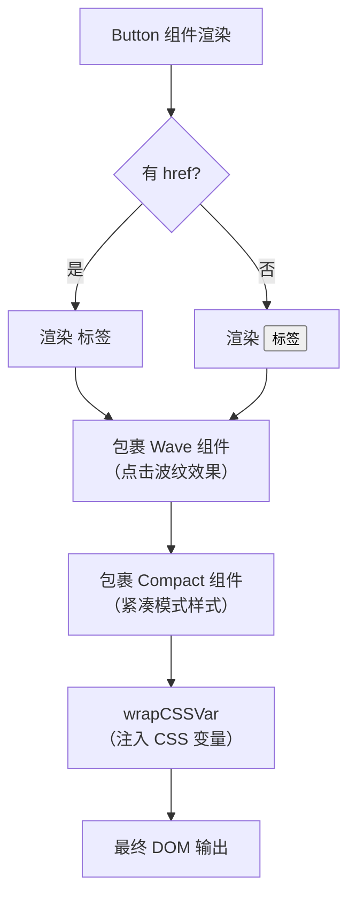
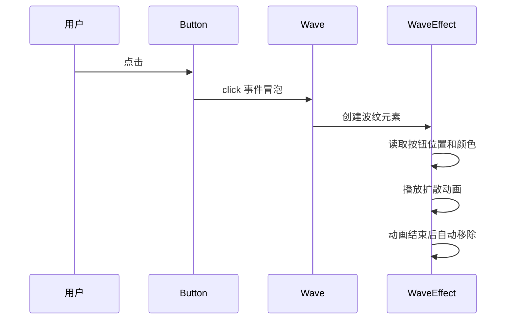
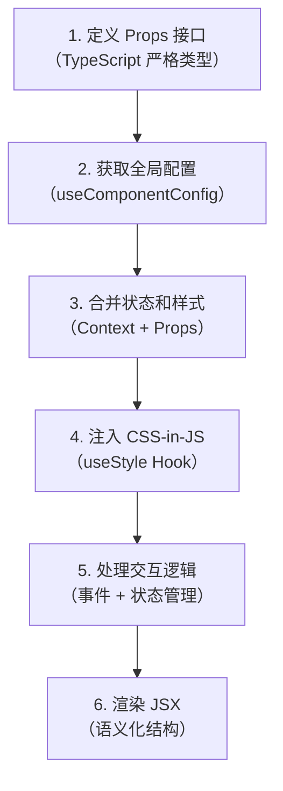

# 04 🔬 组件剖析 — 以 Button 为例

> 拆开一个 Ant Design 组件，看看里面到底有什么。

---

## 📌 本章目标

- 理解 Ant Design 组件的完整结构
- 掌握组件的 Props 设计规范
- 了解 Hooks 在组件中的使用模式
- 学会阅读 Ant Design 组件源码

---

## 4.1 为什么选 Button 做案例？

Button 是 Ant Design 中**最简单但最完整**的组件：
- 代码量适中（~500 行），不会让人望而却步
- 涵盖了几乎所有组件模式：Props 设计、样式系统、Context 消费、Ref 转发、子组件...
- 是其他复杂组件的基础，理解了 Button 就能举一反三

---

## 4.2 组件文件结构

```
components/button/
├── Button.tsx              # 🎯 主角 — 组件核心实现
├── ButtonGroup.tsx         # 🎯 配角 — Button.Group 子组件
├── buttonHelpers.tsx       # 🔧 道具 — 类型定义和工具函数
├── DefaultLoadingIcon.tsx  # 🔄 加载图标组件
├── IconWrapper.tsx         # 📦 图标包装器
├── index.tsx               # 🚪 出口 — 导出整合
├── style/                  # 💅 样式系统（下一章详解）
├── demo/                   # 📖 示例代码
├── __tests__/              # 🧪 测试文件
├── index.en-US.md          # 📝 英文文档
└── index.zh-CN.md          # 📝 中文文档
```

---

## 4.3 组件入口 — `index.tsx`

```typescript
// components/button/index.tsx — 简洁的导出入口
import Button from './Button';

export type { ... } from './buttonHelpers';
export type { ButtonProps, ... } from './Button';

export default Button;
```

**设计原则**：`index.tsx` 只负责导出，不包含任何逻辑。这样做的好处：
- 用户 `import { Button } from 'antd'` 能找到正确的入口
- 导出的类型集中管理，不会遗漏

---

## 4.4 组件核心 — `Button.tsx` 完整解析

### 4.4.1 Props 类型定义

```typescript
// Button 的 Props 设计展示了 Ant Design 的命名规范
export interface ButtonProps {
  // 🎨 外观相关
  type?: ButtonType;           // 按钮类型：primary | default | dashed | text | link
  color?: ButtonColorType;     // 颜色：default | primary | danger | blue | purple...
  variant?: ButtonVariantType; // 变体：solid | outlined | dashed | text | link
  shape?: ButtonShape;         // 形状：default | circle | round
  size?: SizeType;             // 大小：large | middle | small
  
  // 🔧 功能相关
  loading?: boolean | { delay?: number; icon?: ReactNode };
  disabled?: boolean;
  ghost?: boolean;             // 幽灵模式（透明背景）
  block?: boolean;             // 是否撑满父容器宽度
  danger?: boolean;            // 危险操作（红色）
  
  // 🎯 图标相关
  icon?: ReactNode;
  iconPlacement?: 'start' | 'end';  // 图标位置
  
  // 📦 语义化样式
  classNames?: ButtonSemanticClassNames;  // { root, icon, content }
  styles?: ButtonSemanticStyles;
  
  // 📍 HTML 原生属性
  htmlType?: ButtonHTMLType;   // submit | reset | button
  href?: string;               // 链接（渲染为 <a> 标签）
  target?: HTMLAttributeAnchorTarget;
  
  // 📢 事件
  onClick?: React.MouseEventHandler<HTMLElement>;
}
```

### Props 命名规范

| 命名模式 | 示例 | 规则 |
|---------|------|------|
| 布尔开关 | `disabled`, `block`, `ghost` | 形容词，不加 `is` 前缀 |
| 类型枚举 | `type`, `size`, `shape` | 名词 |
| 回调事件 | `onClick` | `on` + 事件名 |
| 子元素 | `icon`, `children` | 名词 |
| 样式定制 | `classNames`, `styles` | 复数形式，对象类型 |

### 4.4.2 核心 Hooks 使用



**关键代码片段**：

```typescript
const InternalButton: React.ForwardRefRenderFunction<
  HTMLButtonElement | HTMLAnchorElement, ButtonProps
> = (props, ref) => {
  const {
    type, color, variant, shape, size, loading,
    disabled, ghost, block, danger, icon, iconPlacement,
    classNames: buttonClassNames,
    styles: buttonStyles,
    children,
    ...rest
  } = props;

  // 1️⃣ 获取全局配置
  const {
    getPrefixCls, direction,
    button: ctxButton,           // ConfigProvider 中的 Button 配置
  } = useComponentConfig('button');

  // 2️⃣ 获取禁用状态（支持全局禁用）
  const disabled = useContext(DisabledContext);
  
  // 3️⃣ 响应式大小（可被 Button.Group 覆盖）
  const groupSize = useContext(GroupSizeContext);
  const mergedSize = useSize((ctx) => groupSize ?? customizeSize ?? ctx);

  // 4️⃣ 样式 Hook（注入 CSS-in-JS 样式）
  const prefixCls = getPrefixCls('btn');
  const [wrapCSSVar, hashId, cssVarCls] = useStyle(prefixCls);

  // 5️⃣ 加载状态管理（支持延迟）
  const [innerLoading, setLoading] = useState(false);
  useLayoutEffect(() => {
    // 如果 loading 有 delay，延迟显示加载状态
    // 防止闪烁：请求很快完成时不显示 loading
    if (typeof loadingOrDelay === 'object' && loadingOrDelay.delay > 0) {
      timer = setTimeout(() => setLoading(true), loadingOrDelay.delay);
    } else {
      setLoading(!!loadingOrDelay);
    }
  }, [loadingOrDelay]);

  // 6️⃣ 中文字符检测（两个汉字之间自动插入空格）
  const [hasTwoCNChar, setHasTwoCNChar] = useState(false);
  useEffect(() => {
    // 检测按钮内容是否恰好是两个中文字符
    // 如果是，自动在中间插入空格（中文排版规范）
  }, [children]);
};
```

### 4.4.3 渲染逻辑

```typescript
// 简化版渲染逻辑
return wrapCSSVar(
  <Compact>   {/* 紧凑模式包装 */}
    <Wave>     {/* 点击波纹效果 */}
      <button   {/* 或 <a> 如果有 href */}
        className={classes}
        disabled={mergedDisabled}
        ref={buttonRef}
        {...rest}
      >
        {/* 图标 */}
        {iconNode && <IconWrapper>{iconNode}</IconWrapper>}
        
        {/* 内容 */}
        {kids && <span>{kids}</span>}
      </button>
    </Wave>
  </Compact>
);
```

### 渲染流程图



---

## 4.5 辅助组件

### ButtonGroup — 按钮组

```tsx
// 使用方式
<Button.Group>
  <Button>左按钮</Button>
  <Button>中按钮</Button>
  <Button>右按钮</Button>
</Button.Group>
```

**实现原理**：通过 `GroupSizeContext` 统一子按钮的大小。

```typescript
// ButtonGroup.tsx 核心逻辑
const ButtonGroup: React.FC<ButtonGroupProps> = ({ size, children }) => {
  const prefixCls = getPrefixCls('btn-group');
  
  return (
    // 通过 Context 向下传递统一的 size
    <GroupSizeContext.Provider value={size}>
      <div className={prefixCls}>
        {children}
      </div>
    </GroupSizeContext.Provider>
  );
};
```

### Wave — 点击波纹

按钮点击时出现的扩散动画效果：



**源码位置**：`components/_util/wave/`

---

## 4.6 组件通用模式总结

通过分析 Button，我们可以总结出 Ant Design 组件的**通用开发模式**：



### 每个组件都会用到的模式

| 模式 | 说明 | Button 中的体现 |
|------|------|----------------|
| **ConfigProvider 消费** | 获取全局配置 | `useComponentConfig('button')` |
| **样式 Hook** | 注入 CSS-in-JS 样式 | `useStyle(prefixCls)` |
| **大小控制** | 支持 large/middle/small | `useSize()` |
| **禁用控制** | 支持全局禁用 | `DisabledContext` |
| **Ref 转发** | 暴露 DOM 引用 | `React.forwardRef` |
| **语义化样式** | classNames / styles | `useMergeSemantic` |
| **紧凑模式** | 支持紧凑 UI | `useCompactItemContext` |

---

## 🤔 思考题

1. 为什么 Button 的 `loading` 支持 `{ delay: number }` 格式？什么场景下需要延迟显示加载状态？
2. 为什么要检测两个中文字符并自动插入空格？这体现了什么设计理念？
3. Wave 波纹效果为什么不直接写在 Button 里，而要抽成独立组件？

---

> ⬅️ [上一章：设计令牌系统](./03-design-tokens.md) | [返回目录](./README.md) | ➡️ [下一章：CSS-in-JS 样式系统](./05-cssinjs-styling.md)
