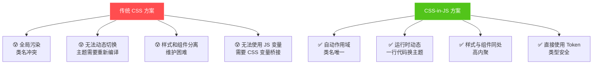
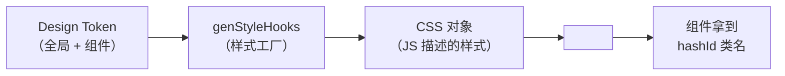
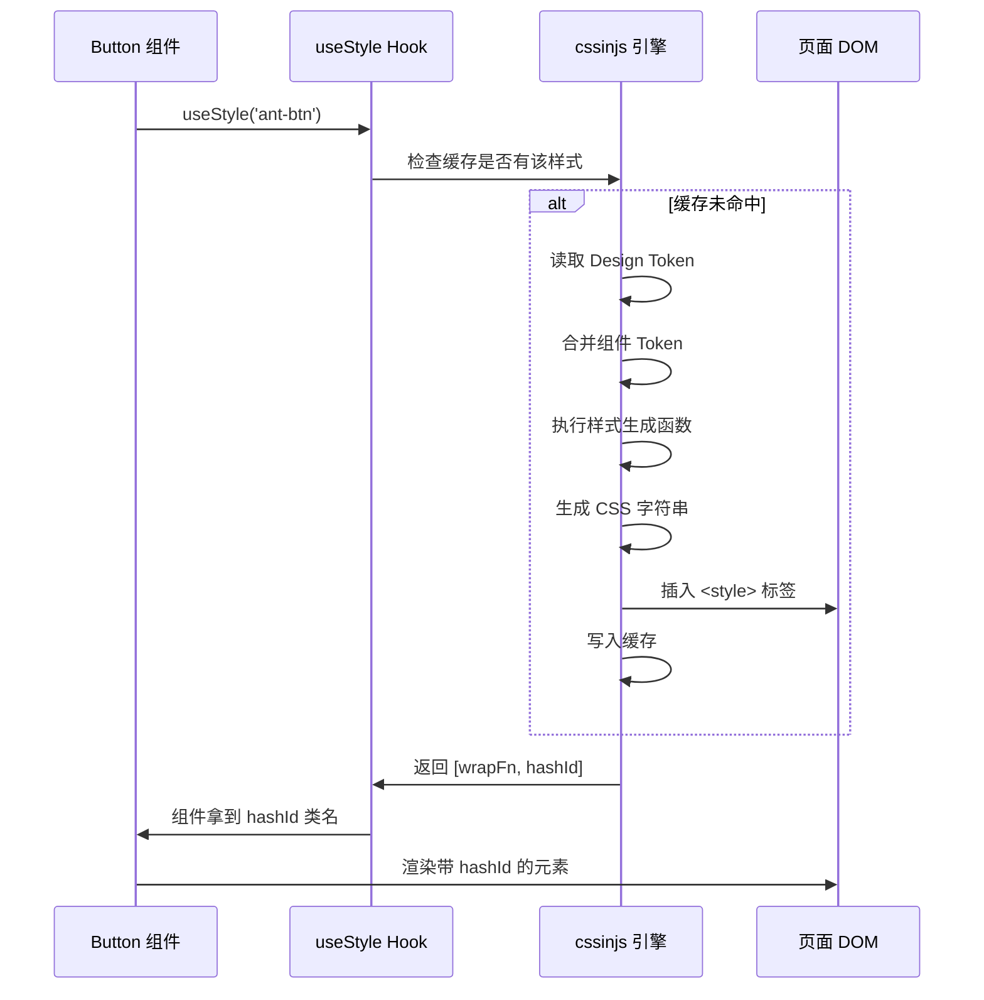
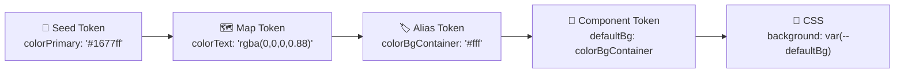
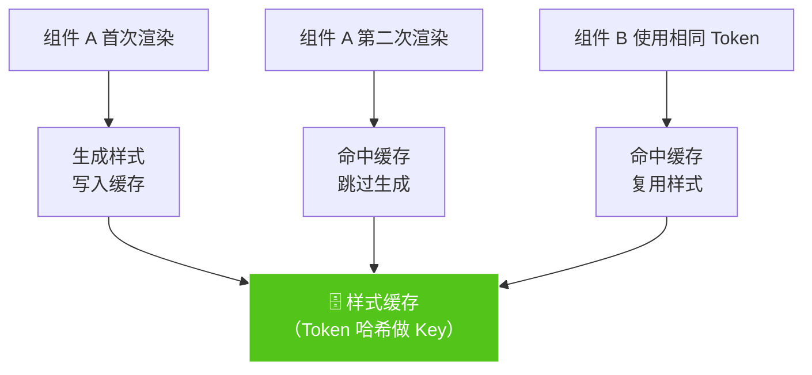

# 05 💅 CSS-in-JS 样式系统

> 深入 Ant Design 的样式架构，理解为什么要用 CSS-in-JS 以及它是如何工作的。

---

## 📌 本章目标

- 理解 CSS-in-JS 的概念和优势
- 掌握 Ant Design 的样式生成流程
- 学会阅读 `style/` 目录下的代码
- 了解自定义样式的方法

---

## 5.1 为什么用 CSS-in-JS？

### 传统 CSS 的痛点



### 通俗理解

- **传统 CSS**：像贴在墙上的便签纸 📝 — 谁都能看到、谁都能改，容易乱
- **CSS-in-JS**：像私人笔记本 📓 — 每个组件有自己的笔记本，互不干扰

---

## 5.2 Ant Design 的样式架构

### 样式库：`@ant-design/cssinjs`

Ant Design 使用自研的 CSS-in-JS 引擎，而非 styled-components 或 Emotion。原因：

| 特点 | @ant-design/cssinjs | styled-components |
|------|---------------------|-------------------|
| 缓存策略 | Token 级缓存 | 组件级缓存 |
| 性能 | 相同 Token 只生成一次 CSS | 每个实例可能生成 |
| SSR 支持 | 内置 | 需额外配置 |
| Token 集成 | 原生支持 | 手动桥接 |

### 样式目录结构

每个组件的 `style/` 目录通常包含：

```
button/style/
├── index.ts        # 🎯 主入口 — 调用 genStyleHooks 生成样式
├── token.ts        # 🎨 Token — 组件专属 Token 定义和准备
├── variant.ts      # 📋 变体 — 不同 variant 的样式（solid/outlined/dashed...）
├── group.ts        # 👥 组合 — ButtonGroup 的样式
└── compact.ts      # 📐 紧凑 — 紧凑模式的样式
```

---

## 5.3 样式生成流程

### 核心函数：`genStyleHooks`

这是每个组件样式的入口，它的作用是：

1. 接收 Design Token
2. 准备组件专属 Token
3. 生成 CSS 对象
4. 注册到 `<style>` 标签



### 实际代码（`button/style/index.ts`）

```typescript
// 源码：components/button/style/index.ts
export default genStyleHooks(
  'Button',                    // 组件名
  (token) => {                 // 样式生成函数
    const buttonToken = prepareToken(token);
    
    return [
      genSharedButtonStyle(buttonToken),    // 基础样式
      genSizeBaseButtonStyle(buttonToken),  // 默认大小
      genSizeSmallButtonStyle(buttonToken), // 小号
      genSizeLargeButtonStyle(buttonToken), // 大号
      genBlockButtonStyle(buttonToken),     // 块级模式
      genVariantStyle(buttonToken),         // 变体样式
      genGroupStyle(buttonToken),           // 按钮组样式
    ];
  },
  prepareComponentToken,       // Token 准备函数
  {
    unitless: {                // 无单位的 Token
      fontWeight: true,
      contentLineHeight: true,
    },
  },
);
```

### 样式生成函数长什么样？

```typescript
// 样式函数返回 CSSObject（用 JS 对象描述 CSS）
const genSharedButtonStyle = (token: ButtonToken): CSSObject => ({
  // 选择器
  [`${token.componentCls}`]: {
    // 布局
    outline: 'none',
    position: 'relative',
    display: 'inline-flex',
    gap: token.iconGap,
    alignItems: 'center',
    justifyContent: 'center',
    
    // 字体
    fontWeight: token.fontWeight,
    fontSize: token.fontSize,
    lineHeight: token.lineHeight,
    whiteSpace: 'nowrap',
    textAlign: 'center',
    
    // 交互
    cursor: 'pointer',
    userSelect: 'none',
    touchAction: 'manipulation',
    
    // 动画
    transition: `all ${token.motionDurationMid} ${token.motionEaseInOut}`,
    
    // 注意：所有数值都来自 Token，不硬编码！
  },
});
```

**关键点**：样式中**没有硬编码的值**！所有数字、颜色、时间都来自 Token。这就是换肤能"一键生效"的根本原因。

---

## 5.4 样式消费流程

### 组件中如何使用样式

```typescript
// 在 Button.tsx 中
const InternalButton = (props, ref) => {
  const prefixCls = getPrefixCls('btn');
  
  // 🎯 核心：调用 useStyle Hook 注入样式
  const [wrapCSSVar, hashId, cssVarCls] = useStyle(prefixCls);
  
  // hashId 是一个唯一标识，确保样式不冲突
  const classes = clsx(
    prefixCls,
    hashId,           // 例如 "css-1a2b3c"
    cssVarCls,
    `${prefixCls}-${type}`,
    {
      [`${prefixCls}-sm`]: sizeClassNameMap[mergedSize] === 'sm',
      [`${prefixCls}-lg`]: sizeClassNameMap[mergedSize] === 'lg',
      [`${prefixCls}-loading`]: innerLoading,
    }
  );
  
  // wrapCSSVar 包装组件，注入 CSS 变量
  return wrapCSSVar(
    <button className={classes} {...rest}>
      {children}
    </button>
  );
};
```

### 完整流程图



---

## 5.5 Token 在样式中的使用

### 组件 Token 准备（`token.ts`）

```typescript
// 源码：components/button/style/token.ts

// 1. 定义组件专属 Token 类型
export interface ComponentToken {
  fontWeight: CSSProperties['fontWeight'];
  primaryColor: string;
  defaultColor: string;
  defaultBg: string;
  defaultBorderColor: string;
  // ... 更多 Token
}

// 2. 准备组件 Token 的默认值
export const prepareComponentToken = (token: GlobalToken): ComponentToken => ({
  fontWeight: 400,
  primaryColor: token.colorTextLightSolid,   // 来自全局 Token
  defaultColor: token.colorText,              // 来自全局 Token
  defaultBg: token.colorBgContainer,          // 来自全局 Token
  defaultBorderColor: token.colorBorder,      // 来自全局 Token
  // ...
});
```

### Token 传递路径



---

## 5.6 自定义样式的三种方式

### 方式一：通过 Token 覆盖（推荐 ✅）

```tsx
<ConfigProvider
  theme={{
    components: {
      Button: {
        colorPrimary: '#ff4d4f',    // 改主色
        borderRadius: 20,            // 改圆角
      },
    },
  }}
>
  <Button type="primary">红色圆角按钮</Button>
</ConfigProvider>
```

### 方式二：通过 classNames / styles（推荐 ✅）

```tsx
<Button
  classNames={{
    root: 'my-button',          // 根元素自定义类名
    icon: 'my-button-icon',     // 图标自定义类名
  }}
  styles={{
    root: { boxShadow: '0 4px 12px rgba(0,0,0,0.1)' },
  }}
>
  带阴影的按钮
</Button>
```

### 方式三：直接覆盖 className（可用但不推荐）

```tsx
<Button className="my-override-button">
  覆盖样式
</Button>
```

```css
/* 需要提高优先级 */
.my-override-button.ant-btn {
  background: linear-gradient(45deg, #1677ff, #722ed1);
}
```

---

## 5.7 样式缓存与性能

### 为什么 CSS-in-JS 不会很慢？



**关键优化**：
1. **Token 级缓存**：相同 Token 组合只生成一次 CSS
2. **哈希标识**：`hashId` 确保样式唯一且可缓存
3. **SSR 兼容**：支持服务端提取样式，避免客户端重新计算

---

## 🤔 思考题

1. CSS-in-JS 相比 Less/SCSS 方案，有什么优势和劣势？什么场景下各自更合适？
2. 为什么样式生成函数中不直接写 `fontSize: 14`，而是写 `fontSize: token.fontSize`？
3. `hashId` 的作用是什么？如果去掉它会发生什么？

---

> ⬅️ [上一章：组件剖析](./04-component-anatomy.md) | [返回目录](./README.md) | ➡️ [下一章：全局配置系统](./06-config-provider.md)
