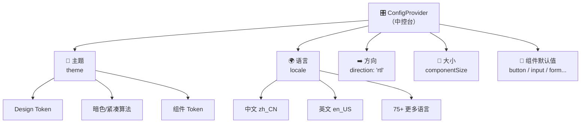
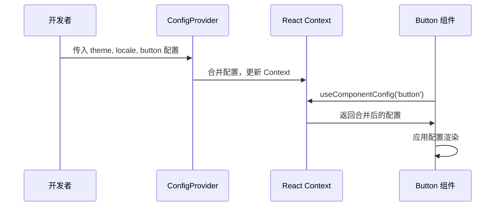
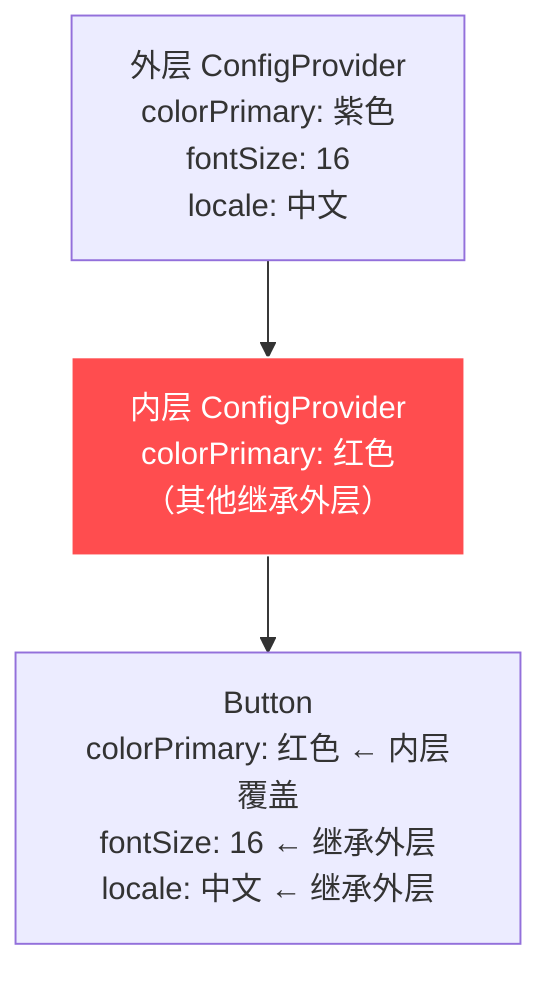
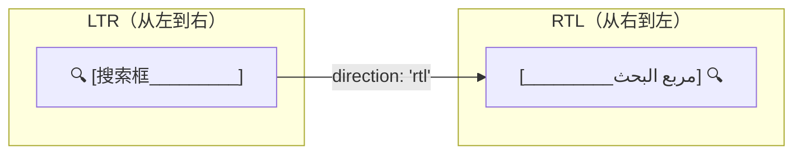

# 06 ⚙️ 全局配置系统（ConfigProvider）

> 理解 Ant Design 的"中控台" — ConfigProvider 如何实现全局配置。

---

## 📌 本章目标

- 理解 ConfigProvider 的作用和原理
- 掌握全局主题配置、组件默认值设置
- 了解 Context 嵌套与继承机制
- 学会阅读 config-provider 源码

---

## 6.1 ConfigProvider 是什么？

### 通俗理解

把 ConfigProvider 想象成你家的**智能家居中控台** 🏠：

- 一个面板控制全屋灯光颜色（= 主题配置）
- 一个面板设置全屋语言（= 国际化）
- 一个面板调整全屋设备默认行为（= 组件默认值）
- 不同房间可以单独覆盖设置（= 嵌套 ConfigProvider）



---

## 6.2 基本用法

### 全局主题配置

```tsx
import { ConfigProvider, Button, Input, Space } from 'antd';
import zhCN from 'antd/locale/zh_CN';

function App() {
  return (
    <ConfigProvider
      // 🎨 主题
      theme={{
        token: { colorPrimary: '#722ed1' },
      }}
      // 🌍 语言
      locale={zhCN}
      // 📏 全局大小
      componentSize="large"
    >
      <Space>
        <Button type="primary">紫色主按钮</Button>
        <Input placeholder="大号输入框" />
      </Space>
    </ConfigProvider>
  );
}
```

### 组件默认值配置

```tsx
<ConfigProvider
  button={{
    // 所有 Button 的默认变体改为 solid
    variant: 'solid',
    // 所有 Button 默认加载图标
    // autoInsertSpace: false, // 关闭中文两字按钮自动插入空格
  }}
  input={{
    // 所有 Input 的默认变体
    variant: 'filled',
  }}
  form={{
    // 所有 Form 的冒号设置
    colon: false,
    // 必填标记样式
    requiredMark: 'optional',
  }}
>
  <MyApp />
</ConfigProvider>
```

---

## 6.3 Context 原理

### 源码核心

**源码位置**：`components/config-provider/context.ts`

ConfigProvider 的核心是 React Context：

```typescript
// 简化版源码
export const ConfigContext = React.createContext<ConfigConsumerProps>({
  getPrefixCls: defaultGetPrefixCls,
  iconPrefixCls: defaultIconPrefixCls,
});

// 配置类型（节选）
interface ConfigConsumerProps {
  // 前缀相关
  getPrefixCls: (suffixCls?: string) => string;
  iconPrefixCls: string;
  
  // 全局配置
  locale?: Locale;
  direction?: 'ltr' | 'rtl';
  theme?: ThemeConfig;
  
  // 50+ 组件的默认配置
  button?: ButtonConfig;
  input?: InputConfig;
  form?: FormConfig;
  table?: TableConfig;
  modal?: ModalConfig;
  // ...
}
```

### 组件如何消费配置

```typescript
// 组件内部使用 useComponentConfig Hook
const InternalButton = (props) => {
  // 一个 Hook 获取所有需要的配置
  const {
    getPrefixCls,     // CSS 类名前缀生成器
    direction,         // 文字方向 ltr/rtl
    // ...Button 的全局默认配置
  } = useComponentConfig('button');
  
  // getPrefixCls('btn') → 'ant-btn'
  const prefixCls = getPrefixCls('btn');
};
```

### 消费流程



---

## 6.4 嵌套与继承

ConfigProvider 支持**嵌套**，内层会继承并覆盖外层的配置：

```tsx
// 外层：全局紫色主题
<ConfigProvider theme={{ token: { colorPrimary: '#722ed1' } }}>
  <Button type="primary">紫色按钮</Button>
  
  {/* 内层：局部红色主题（只影响这个区域） */}
  <ConfigProvider theme={{ token: { colorPrimary: '#ff4d4f' } }}>
    <Button type="primary">红色按钮</Button>
  </ConfigProvider>
  
  <Button type="primary">还是紫色按钮</Button>
</ConfigProvider>
```

### 继承规则



**通俗理解**：就像 CSS 的继承 — 子元素继承父元素的样式，但可以局部覆盖。

---

## 6.5 CSS 类名前缀系统

### `getPrefixCls` 的作用

```typescript
// 默认前缀是 'ant'
getPrefixCls('btn')     → 'ant-btn'
getPrefixCls('input')   → 'ant-input'
getPrefixCls('modal')   → 'ant-modal'
```

**为什么需要前缀？**

```tsx
// 场景：同一页面使用两个不同版本的 Ant Design
<ConfigProvider prefixCls="v5">
  {/* v5 的组件：类名是 v5-btn, v5-input */}
  <Button>V5 按钮</Button>
</ConfigProvider>

<ConfigProvider prefixCls="v4">
  {/* v4 的组件：类名是 v4-btn, v4-input */}
  <Button>V4 按钮</Button>
</ConfigProvider>
```

前缀避免了不同版本组件的**样式冲突**。虽然这种场景不常见，但在大型企业的微前端架构中非常有用。

---

## 6.6 RTL（从右到左）支持

某些语言（如阿拉伯语、希伯来语）是从右到左书写的：

```tsx
<ConfigProvider direction="rtl">
  {/* 所有组件自动镜像翻转 */}
  <Input prefix={<SearchOutlined />} placeholder="بحث..." />
</ConfigProvider>
```

### RTL 的实现原理



**源码层面**：组件样式中使用 CSS 逻辑属性（Logical Properties），而非物理属性：

```typescript
// ❌ 物理属性（不支持 RTL 自动翻转）
marginLeft: 8,
paddingRight: 16,

// ✅ 逻辑属性（自动适应 RTL）
marginInlineStart: 8,    // LTR = marginLeft, RTL = marginRight
paddingInlineEnd: 16,    // LTR = paddingRight, RTL = paddingLeft
```

---

## 6.7 完整配置清单

ConfigProvider 支持的主要配置项：

| 配置项 | 类型 | 说明 |
|--------|------|------|
| `theme` | ThemeConfig | 主题配置（Token、算法、组件 Token） |
| `locale` | Locale | 国际化语言包 |
| `direction` | `'ltr'` \| `'rtl'` | 文字方向 |
| `componentSize` | `'small'` \| `'middle'` \| `'large'` | 全局组件大小 |
| `prefixCls` | string | CSS 类名前缀 |
| `getPopupContainer` | () => HTMLElement | 弹出层挂载节点 |
| `virtual` | boolean | 是否启用虚拟滚动 |
| `csp` | { nonce: string } | Content Security Policy |
| `button` | ButtonConfig | Button 组件全局配置 |
| `input` | InputConfig | Input 组件全局配置 |
| `form` | FormConfig | Form 组件全局配置 |
| ... | ... | 50+ 组件的全局配置 |

---

## 🤔 思考题

1. ConfigProvider 嵌套时，内层的 `theme.token` 是**完全覆盖**外层还是**合并**？
2. 为什么 RTL 支持要用 CSS 逻辑属性（`marginInlineStart`）而不是简单的 `transform: scaleX(-1)`？
3. 在微前端架构中，`prefixCls` 为什么重要？

---

> ⬅️ [上一章：CSS-in-JS 样式系统](./05-cssinjs-styling.md) | [返回目录](./README.md) | ➡️ [下一章：国际化系统](./07-i18n.md)
