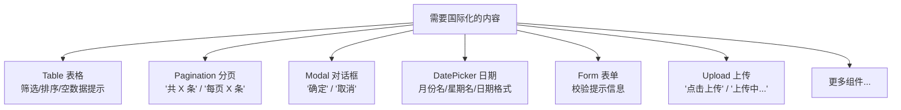
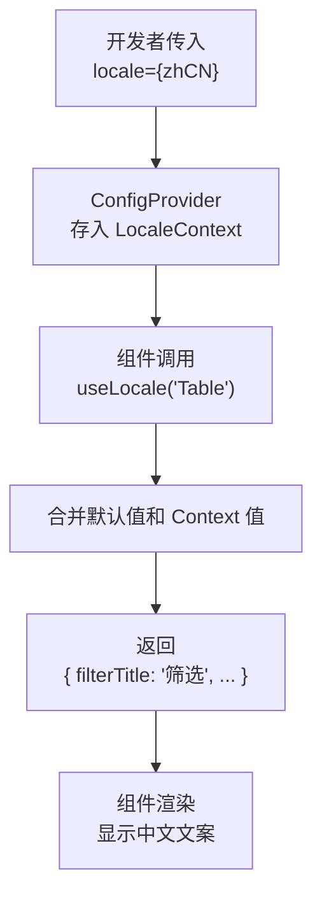
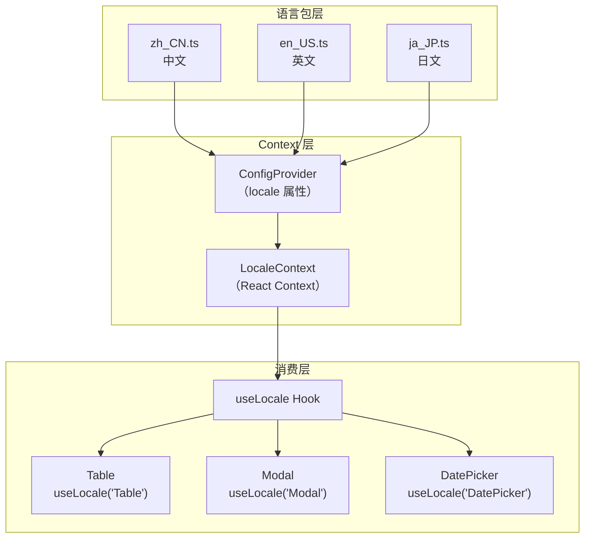

# 07 🌍 国际化系统（i18n）

> 了解 Ant Design 如何支持 75+ 种语言，以及多语言背后的实现原理。

---

## 📌 本章目标

- 理解 Ant Design 国际化的架构设计
- 掌握多语言切换的使用方法
- 学会阅读和添加语言包
- 了解 `useLocale` Hook 的工作原理

---

## 7.1 为什么需要国际化？

### 通俗理解

想象你开了一家国际连锁餐厅 🍽️：
- 每家分店的菜单需要**当地语言**
- 但菜品（组件功能）是一样的
- 国际化 = 给同样的菜品配不同语言的菜单

### Ant Design 中需要翻译的内容



---

## 7.2 使用方法

### 基本用法

```tsx
import { ConfigProvider } from 'antd';
import zhCN from 'antd/locale/zh_CN';  // 中文
import enUS from 'antd/locale/en_US';  // 英文
import jaJP from 'antd/locale/ja_JP';  // 日文

function App() {
  const [locale, setLocale] = useState(zhCN);
  
  return (
    <ConfigProvider locale={locale}>
      {/* 所有组件自动使用对应语言 */}
      <Table columns={columns} dataSource={data} />
      <Pagination total={100} />
      <DatePicker />
    </ConfigProvider>
  );
}
```

### 切换语言

```tsx
// 动态切换 — 只需改变 locale 属性
<Select onChange={(lang) => {
  const localeMap = { zh: zhCN, en: enUS, ja: jaJP };
  setLocale(localeMap[lang]);
}}>
  <Option value="zh">中文</Option>
  <Option value="en">English</Option>
  <Option value="ja">日本語</Option>
</Select>
```

---

## 7.3 语言包结构

### 文件位置：`components/locale/`

```
locale/
├── en_US.ts        # 英文（美国）— 默认语言
├── zh_CN.ts        # 中文（简体）
├── zh_TW.ts        # 中文（繁体）
├── ja_JP.ts        # 日文
├── ko_KR.ts        # 韩文
├── de_DE.ts        # 德文
├── fr_FR.ts        # 法文
├── ar_EG.ts        # 阿拉伯文
├── ... (75+ 语言)
└── index.tsx        # 类型定义和导出
```

### 语言包内容（以 `zh_CN.ts` 为例）

```typescript
// 源码：components/locale/zh_CN.ts
const localeValues: Locale = {
  locale: 'zh-cn',
  
  // 全局文案
  global: {
    placeholder: '请选择',
    close: '关闭',
  },
  
  // 表格
  Table: {
    filterTitle: '筛选',
    filterConfirm: '确定',
    filterReset: '重置',
    filterEmptyText: '无筛选项',
    selectAll: '全选当页',
    selectInvert: '反选当页',
    selectionAll: '全选所有',
    sortTitle: '排序',
    emptyText: '暂无数据',
    // ...
  },
  
  // 对话框
  Modal: {
    okText: '确定',
    cancelText: '取消',
    justOkText: '知道了',
  },
  
  // 日期选择器
  DatePicker: {
    lang: {
      placeholder: '请选择日期',
      yearPlaceholder: '请选择年份',
      monthPlaceholder: '请选择月份',
      // ...
    },
    timePickerLocale: {
      placeholder: '请选择时间',
    },
  },
  
  // 表单校验
  Form: {
    defaultValidateMessages: {
      required: '${label}是必填字段',
      types: {
        string: '${label}不是有效的${type}',
        number: '${label}不是有效的${type}',
        // ...
      },
      number: {
        range: '${label}必须在${min}-${max}之间',
      },
    },
  },
  
  // 更多组件...
};
```

---

## 7.4 实现原理

### `useLocale` Hook

**源码位置**：`components/locale/useLocale.ts`

```typescript
const useLocale = <C extends LocaleComponentName>(
  componentName: C,                           // 组件名，如 'Table'
  defaultLocale?: Locale[C],                  // 默认翻译（兜底）
) => {
  // 1. 从 Context 获取当前语言包
  const fullLocale = React.useContext(LocaleContext);
  
  // 2. 合并：组件默认翻译 + Context 中的翻译
  const getLocale = React.useMemo(() => {
    const locale = defaultLocale || defaultLocaleData[componentName];
    const localeFromContext = fullLocale?.[componentName] ?? {};
    return {
      ...(typeof locale === 'function' ? locale() : locale),
      ...(localeFromContext || {}),  // Context 中的值优先
    };
  }, [componentName, defaultLocale, fullLocale]);
  
  // 3. 返回翻译对象和语言代码
  return [getLocale, localeCode] as const;
};
```

### 数据流



### 组件中的使用

```typescript
// Table 组件中使用 useLocale
const Table = (props) => {
  // 获取 Table 的翻译文案
  const [locale] = useLocale('Table', defaultLocale.Table);
  
  return (
    <div>
      {/* 使用翻译后的文案 */}
      <span>{locale.filterTitle}</span>      {/* "筛选" */}
      <button>{locale.filterConfirm}</button> {/* "确定" */}
      {data.length === 0 && (
        <Empty description={locale.emptyText} />  {/* "暂无数据" */}
      )}
    </div>
  );
};
```

---

## 7.5 如何添加新语言

### Step 1：创建语言文件

```typescript
// 新建 components/locale/xx_XX.ts
import type { Locale } from '.';

const localeValues: Locale = {
  locale: 'xx',
  
  global: {
    placeholder: '...翻译...',
    close: '...翻译...',
  },
  
  Table: {
    filterTitle: '...翻译...',
    // 参考 en_US.ts，翻译所有字段
  },
  
  Modal: {
    okText: '...翻译...',
    cancelText: '...翻译...',
  },
  
  // ... 翻译所有组件的文案
};

export default localeValues;
```

### Step 2：注意事项

1. **参考 `en_US.ts`**：它是最完整的语言包，确保不遗漏字段
2. **保持结构一致**：所有语言文件的结构必须相同
3. **变量占位符**：使用 `${label}`、`${min}` 等占位符
4. **日期格式**：注意不同语言的日期显示格式（如中文 `YYYY年MM月DD日`，英文 `MM/DD/YYYY`）

---

## 7.6 国际化架构图



---

## 🤔 思考题

1. 为什么 Ant Design 的国际化只处理组件内置文案，不处理用户传入的业务文案？
2. 如果需要在同一页面展示两种语言（比如中英文对照），ConfigProvider 嵌套能实现吗？
3. 表单校验信息中的 `${label}` 是在什么时候被替换成实际值的？

---

> ⬅️ [上一章：全局配置系统](./06-config-provider.md) | [返回目录](./README.md) | ➡️ [下一章：测试体系](./08-testing.md)
