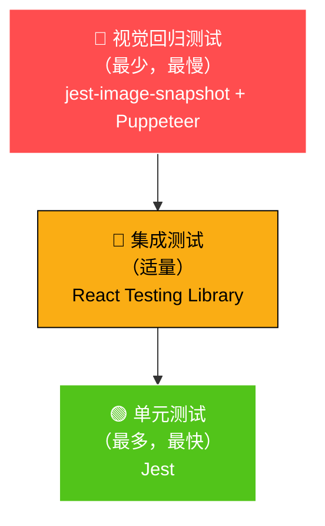
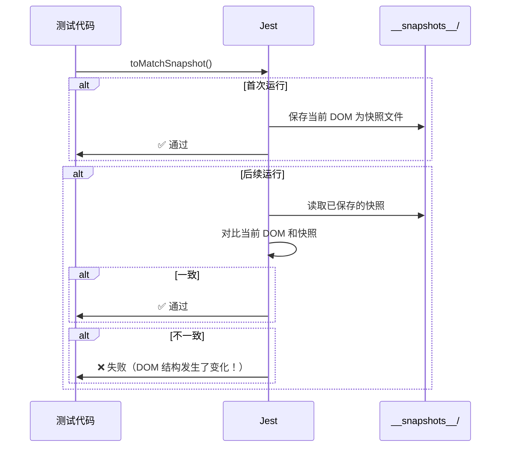
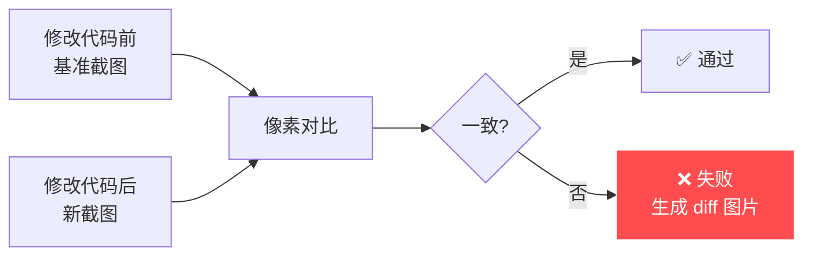

# 08 🧪 测试体系

> 了解 Ant Design 如何保证 80+ 组件的质量 — 从单元测试到视觉回归测试。

---

## 📌 本章目标

- 了解 Ant Design 的测试策略和覆盖范围
- 掌握组件测试的常用模式
- 理解快照测试和视觉回归测试的价值
- 学会编写 Ant Design 风格的组件测试

---

## 8.1 测试策略总览

### 测试金字塔



| 测试类型 | 工具 | 数量 | 速度 | 测试什么 |
|---------|------|------|------|---------|
| 单元测试 | Jest | 最多 | 最快 | 函数逻辑、Props 处理 |
| 集成测试 | React Testing Library | 适量 | 中等 | 组件交互、状态变化 |
| 快照测试 | Jest Snapshot | 每组件 | 快 | DOM 结构稳定性 |
| 可访问性测试 | jest-axe | 每组件 | 快 | WCAG 合规性 |
| 视觉回归测试 | Puppeteer + jest-image-snapshot | 少量 | 最慢 | 像素级视觉对比 |

---

## 8.2 测试配置

### Jest 配置文件

Ant Design 有多个 Jest 配置，针对不同测试场景：

```
.jest.js          # 主配置 — 组件单元/集成测试（jsdom 环境）
.jest.image.js    # 视觉回归测试（jest-image-snapshot）
.jest.node.js     # Node 环境测试（SSR 兼容性）
.jest.site.js     # 文档站点测试
```

### 主配置核心内容

```javascript
// .jest.js（简化版）
module.exports = {
  verbose: true,
  testEnvironment: 'jsdom',           // 模拟浏览器环境
  setupFiles: ['./tests/setup.ts'],   // 全局 setup
  setupFilesAfterEnv: ['./tests/setupAfterEnv.ts'],
  
  // 测试文件匹配规则
  testRegex: '.*\\.test\\.(j|t)sx?$',
  
  // 模块文件扩展
  moduleFileExtensions: ['ts', 'tsx', 'js', 'jsx', 'json', 'md'],
};
```

---

## 8.3 测试模式详解

### 模式一：挂载测试（Mount Test）

> 验证组件是否能正常渲染，不抛错。

```typescript
// 源码：tests/shared/mountTest.tsx
// 在每个组件测试中复用

import mountTest from '../../../tests/shared/mountTest';

describe('Button', () => {
  // 基础挂载测试
  mountTest(Button);
  mountTest(() => <Button size="large" />);
  mountTest(() => <Button size="small" />);
  mountTest(Button.Group);
});
```

**为什么需要？** 最基本的冒烟测试 — 组件能渲染出来就说明基本没崩。

### 模式二：快照测试（Snapshot Test）

> 记录组件的 DOM 结构，后续变更时自动对比。

```typescript
it('renders correctly', () => {
  const { container } = render(<Button>Follow</Button>);
  expect(container.firstChild).toMatchSnapshot();
});
```

**工作原理**：



**通俗理解**：快照测试就像给组件拍"X 光片" 📸 — 每次修改代码后对比，确认骨架（DOM 结构）没有意外变化。

### 模式三：RTL 测试

> 验证组件在从右到左布局下的行为。

```typescript
import rtlTest from '../../../tests/shared/rtlTest';

describe('Button', () => {
  rtlTest(Button);
  rtlTest(() => <Button size="large" />);
});
```

### 模式四：交互测试

> 模拟用户操作，验证组件响应。

```typescript
it('should support loading delay', async () => {
  const { container } = render(<Button loading={{ delay: 500 }} />);
  
  // 初始状态不显示 loading
  expect(container.querySelector('.ant-btn-loading')).toBeNull();
  
  // 等待 500ms 后显示 loading
  await waitFakeTimer(500);
  expect(container.querySelector('.ant-btn-loading')).toBeTruthy();
});

it('fires onClick event', () => {
  const onClick = jest.fn();
  const { container } = render(<Button onClick={onClick}>Click</Button>);
  
  fireEvent.click(container.firstChild!);
  expect(onClick).toHaveBeenCalled();
});
```

### 模式五：可访问性测试

> 验证组件符合 WCAG 可访问性标准。

```typescript
// 源码：components/button/__tests__/a11y.test.ts
import { accessibilityTest } from '../../../tests/shared/accessibilityTest';

describe('Button accessibility', () => {
  accessibilityTest(Button);
});
```

**使用 jest-axe 检查**：
- 是否有正确的 ARIA 角色
- 颜色对比度是否足够
- 是否支持键盘导航
- 是否有合适的 alt 文本

### 模式六：警告验证

> 确保组件对错误用法给出合理的警告。

```typescript
it('warns if size is wrong', () => {
  const mockWarn = jest.spyOn(console, 'error').mockImplementation(() => {});
  
  render(<Button.Group size={'invalid' as any} />);
  
  expect(mockWarn).toHaveBeenCalledWith(
    'Warning: [antd: Button.Group] Invalid prop `size`.'
  );
  mockWarn.mockRestore();
});
```

---

## 8.4 视觉回归测试

### 什么是视觉回归测试？

> 对比组件渲染的**截图**，像素级别检查视觉是否有变化。



### 配置和工具

```javascript
// .jest.image.js
module.exports = {
  preset: 'jest-puppeteer',   // 使用 Puppeteer 控制真实浏览器
  // Puppeteer 打开浏览器 → 渲染组件 → 截图 → 对比
};
```

**通俗理解**：快照测试是对比"骨架"（DOM），视觉回归测试是对比"照片"（截图）。后者能发现 CSS 层面的问题（比如颜色错了、间距不对），但前者可能看不出来。

---

## 8.5 运行测试命令

```bash
# 运行所有单元测试
npm test

# 运行特定组件的测试
npx jest components/button

# 运行视觉回归测试
npm run test:image

# 运行 Node 环境测试（SSR）
npm run test:node

# 更新快照
npx jest --updateSnapshot

# 查看测试覆盖率
npx jest --coverage
```

---

## 8.6 测试目录结构

```
components/button/__tests__/
├── index.test.tsx          # 主测试文件（挂载、快照、交互）
├── a11y.test.ts           # 可访问性测试
├── wave.test.tsx           # 波纹效果测试
├── delay-timer.test.tsx    # 延迟计时器测试
└── __snapshots__/
    └── index.test.tsx.snap # 快照文件（自动生成）
```

---

## 8.7 编写测试的最佳实践

| 实践 | 说明 | 示例 |
|------|------|------|
| **测试行为，不测实现** | 测试用户能感知到的行为 | 测试"点击按钮后文字变化"，而非"state 变了" |
| **使用 Testing Library** | 按用户视角查找元素 | `getByRole('button')` 而非 `container.querySelector('.ant-btn')` |
| **复用共享测试** | mount/rtl/a11y 测试复用 | `mountTest(Button)` |
| **Mock 外部依赖** | 隔离测试环境 | `jest.useFakeTimers()` |
| **清理副作用** | 每个测试独立 | `afterEach(() => cleanup())` |

---

## 🤔 思考题

1. 快照测试和视觉回归测试的区别是什么？各自适合什么场景？
2. 为什么要在 `jsdom` 环境测试？`node` 环境测试是为了什么？
3. 如果修改了一个 Token 的默认值，会影响哪些测试？如何高效地更新？

---

> ⬅️ [上一章：国际化系统](./07-i18n.md) | [返回目录](./README.md) | ➡️ [下一章：参与贡献指南](./09-contributing.md)
