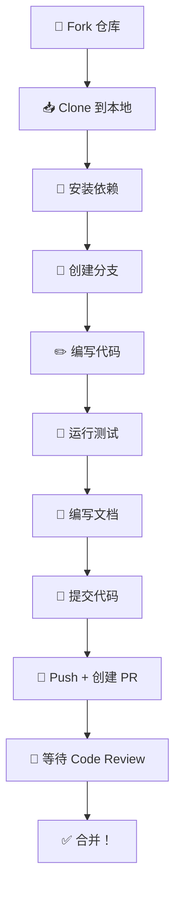

# 09 🤝 参与贡献指南

> 从环境搭建到提交 PR，手把手教你参与 Ant Design 开源贡献。

---

## 📌 本章目标

- 搭建 Ant Design 本地开发环境
- 了解贡献流程和规范
- 掌握代码提交和 PR 规范
- 学会开发一个新组件（或修复 Bug）的完整流程

---

## 9.1 贡献流程概览



---

## 9.2 环境搭建

### 前置要求

| 工具 | 版本要求 | 检查命令 |
|------|---------|---------|
| Node.js | ≥ 18.0 | `node -v` |
| npm | ≥ 9.0 | `npm -v` |
| Git | 最新版 | `git --version` |

### 搭建步骤

```bash
# 1. Fork 仓库（在 GitHub 页面点 Fork）

# 2. Clone 你的 Fork
git clone https://github.com/你的用户名/ant-design.git
cd ant-design

# 3. 添加上游仓库（用于同步最新代码）
git remote add upstream https://github.com/ant-design/ant-design.git

# 4. 安装依赖
npm install

# 5. 启动开发服务器
npm start
# 浏览器打开 http://localhost:8000

# 6. 运行测试（验证环境正常）
npm test -- --testPathPattern=button
```

---

## 9.3 分支规范

```bash
# 功能开发
git checkout -b feat/add-new-button-variant

# Bug 修复
git checkout -b fix/button-loading-delay

# 文档更新
git checkout -b docs/update-button-api

# 代码重构
git checkout -b refactor/button-style-optimization
```

| 前缀 | 用途 | 目标分支 |
|------|------|---------|
| `feat/` | 新功能 | `feature` |
| `fix/` | Bug 修复 | `master` |
| `docs/` | 文档更新 | `master` |
| `refactor/` | 代码重构 | `master` |

---

## 9.4 修复 Bug 的完整流程

### 示例：修复 Button loading 延迟问题

**Step 1：重现问题**

```tsx
// 在 components/button/demo/ 下创建测试用例
import { Button } from 'antd';

const App = () => (
  // 复现 bug 的最小代码
  <Button loading={{ delay: 100 }}>测试</Button>
);
```

**Step 2：编写失败的测试**

```typescript
// components/button/__tests__/index.test.tsx
it('should handle loading delay correctly', async () => {
  jest.useFakeTimers();
  const { container } = render(
    <Button loading={{ delay: 100 }}>Click</Button>
  );
  
  // 0ms 时不应该显示 loading
  expect(container.querySelector('.ant-btn-loading')).toBeNull();
  
  // 100ms 后应该显示 loading
  act(() => jest.advanceTimersByTime(100));
  expect(container.querySelector('.ant-btn-loading')).toBeTruthy();
  
  jest.useRealTimers();
});
```

**Step 3：修复代码**

```typescript
// 修改 components/button/Button.tsx 中的相关逻辑
```

**Step 4：验证测试通过**

```bash
npx jest components/button --verbose
```

**Step 5：更新文档（如果需要）**

**Step 6：提交**

```bash
git add .
git commit -m "fix: fix Button loading delay not working correctly"
```

---

## 9.5 开发新组件的流程

### Step 1：创建目录结构

```bash
mkdir -p components/my-component/{demo,style,__tests__}
```

```
components/my-component/
├── MyComponent.tsx         # 主组件
├── index.tsx               # 导出
├── style/
│   ├── index.ts           # 样式
│   └── token.ts           # Token
├── demo/
│   ├── basic.tsx          # 基础示例
│   └── basic.md           # 示例说明
├── __tests__/
│   └── index.test.tsx     # 测试
├── index.en-US.md          # 英文文档
└── index.zh-CN.md          # 中文文档
```

### Step 2：实现组件

```tsx
// components/my-component/MyComponent.tsx
import React from 'react';
import { useComponentConfig } from '../config-provider/context';
import useStyle from './style';

export interface MyComponentProps {
  children?: React.ReactNode;
  className?: string;
}

const MyComponent: React.FC<MyComponentProps> = (props) => {
  const { children, className } = props;
  
  // 获取全局配置
  const { getPrefixCls } = useComponentConfig('myComponent');
  const prefixCls = getPrefixCls('my-component');
  
  // 注入样式
  const [wrapCSSVar, hashId] = useStyle(prefixCls);
  
  return wrapCSSVar(
    <div className={`${prefixCls} ${hashId} ${className || ''}`}>
      {children}
    </div>
  );
};

export default MyComponent;
```

### Step 3：注册导出

```typescript
// components/index.ts
export { default as MyComponent } from './my-component';
export type { MyComponentProps } from './my-component';
```

### Step 4：编写测试

```typescript
// components/my-component/__tests__/index.test.tsx
import { render } from '../../../tests/utils';
import mountTest from '../../../tests/shared/mountTest';
import rtlTest from '../../../tests/shared/rtlTest';
import MyComponent from '..';

describe('MyComponent', () => {
  mountTest(MyComponent);
  rtlTest(MyComponent);
  
  it('renders correctly', () => {
    const { container } = render(
      <MyComponent>Hello</MyComponent>
    );
    expect(container.firstChild).toMatchSnapshot();
  });
});
```

---

## 9.6 提交规范

### Commit Message 格式

```
类型: 简短描述（英文）

# 示例：
fix: fix Button loading state not clearing on unmount
feat: add color prop for Button component
docs: update Button API documentation
refactor: refactor Button style generation
test: add test for Button loading delay
chore: update dependencies
```

| 类型 | 说明 |
|------|------|
| `fix` | 修复 Bug |
| `feat` | 新功能 |
| `docs` | 文档更新 |
| `refactor` | 代码重构（不改变功能） |
| `test` | 测试相关 |
| `chore` | 构建/工具/依赖更新 |
| `style` | 代码格式（不影响功能） |

### PR 规范

PR 标题格式与 commit message 相同。PR 描述需要使用仓库提供的模板：

- 英文模板：`.github/PULL_REQUEST_TEMPLATE.md`
- 中文模板：`.github/PULL_REQUEST_TEMPLATE_CN.md`

### Changelog 规范

对于用户可感知的变更，需要更新 `CHANGELOG.zh-CN.md` 和 `CHANGELOG.en-US.md`：

```markdown
<!-- CHANGELOG.zh-CN.md -->
- 🐞 修复 Button 在 loading delay 情况下状态不正确的问题。[#12345](链接)
- 🆕 Button 新增 `color` 属性支持。[#12346](链接)
```

---

## 9.7 常用开发命令

```bash
# 启动开发服务器
npm start

# 运行单个组件测试
npx jest components/button

# 运行所有测试
npm test

# 更新快照
npx jest --updateSnapshot

# 代码检查
npm run lint

# 代码格式化
npm run format

# 类型检查
npm run tsc

# 构建
npm run build
```

---

## 9.8 贡献类型

| 类型 | 难度 | 适合 | PR 标签 |
|------|------|------|---------|
| 🐞 Bug 修复 | ⭐⭐ | 新手 | `bug` |
| 📝 文档改进 | ⭐ | 新手 | `documentation` |
| 📽️ Demo 改进 | ⭐ | 新手 | `demo` |
| 🌐 国际化 | ⭐⭐ | 新手 | `i18n` |
| 🆕 新特性 | ⭐⭐⭐ | 有经验 | `feature` |
| ⚡️ 性能优化 | ⭐⭐⭐⭐ | 资深 | `performance` |
| 🛠 架构重构 | ⭐⭐⭐⭐⭐ | 核心贡献者 | `refactor` |

---

## 🤔 思考题

1. 为什么要先写"失败的测试"再修复代码？这叫什么开发方法？
2. 开发一个新组件时，为什么要用 `useComponentConfig` 而不是直接硬编码类名前缀？
3. Commit message 为什么要用英文？PR 描述可以用中文吗？

---

> ⬅️ [上一章：测试体系](./08-testing.md) | [返回目录](./README.md) | ➡️ [下一章：最佳实践与进阶](./10-best-practices.md)
