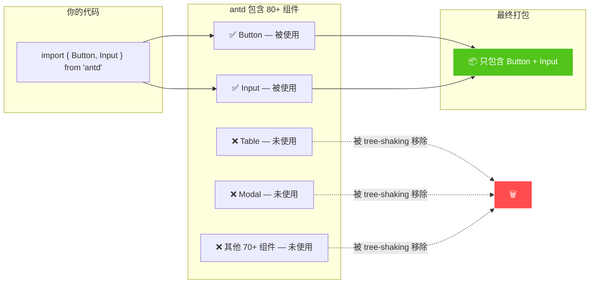
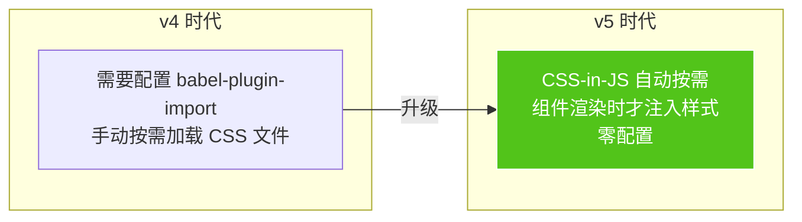
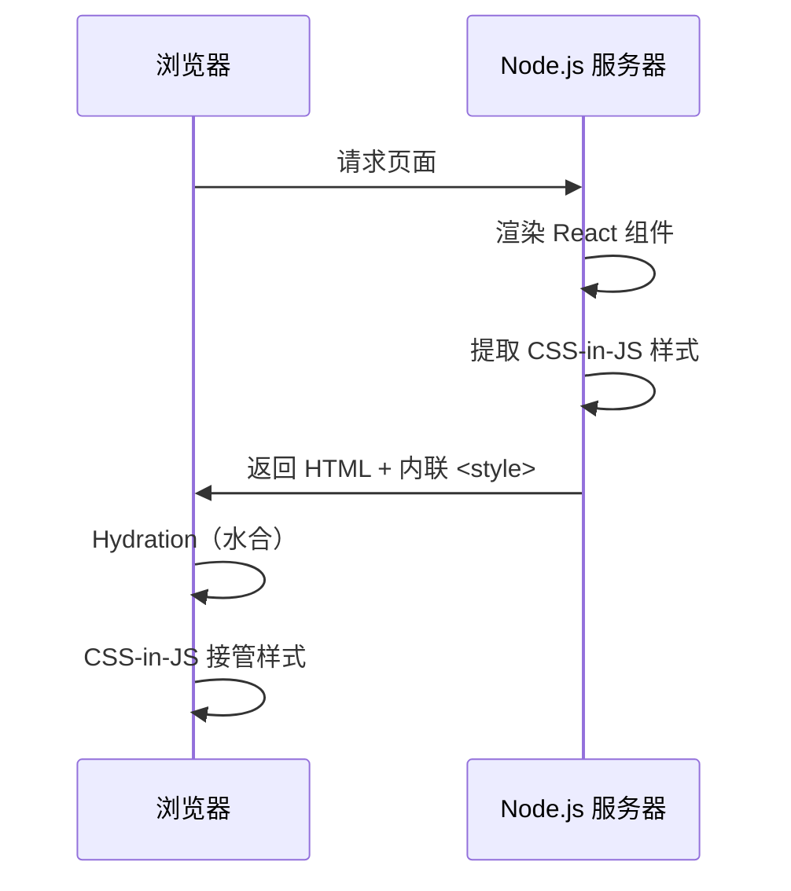
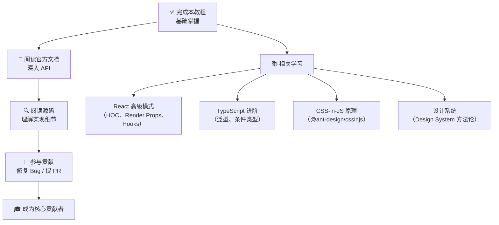

# 10 🚀 最佳实践与进阶

> 性能优化、按需加载、SSR 等生产环境必备知识。

---

## 📌 本章目标

- 掌握 Ant Design 的性能优化技巧
- 理解 Tree-shaking 和按需加载
- 了解 SSR 服务端渲染的支持
- 掌握常见问题的解决方案

---

## 10.1 性能优化

### Tree-shaking（摇树优化）

> 只打包你用到的组件，未使用的代码会被自动移除。



**为什么能 Tree-shaking？**

Ant Design 的 ES Module 版本（`es/` 目录）使用了 ES6 的 `export` 语法，Webpack/Vite 等构建工具可以静态分析依赖关系，移除未引用的代码。

```typescript
// ✅ 具名导入 — 支持 tree-shaking
import { Button } from 'antd';

// ❌ 全量导入 — 无法 tree-shaking
import antd from 'antd';
const Button = antd.Button;
```

### 减少重渲染

```tsx
// ❌ 每次父组件渲染都会创建新的 theme 对象
function App() {
  return (
    <ConfigProvider
      theme={{ token: { colorPrimary: '#722ed1' } }}  // 每次都是新对象
    >
      <MyPage />
    </ConfigProvider>
  );
}

// ✅ 使用 useMemo 缓存 theme 对象
function App() {
  const theme = useMemo(() => ({
    token: { colorPrimary: '#722ed1' },
  }), []);
  
  return (
    <ConfigProvider theme={theme}>
      <MyPage />
    </ConfigProvider>
  );
}
```

### 虚拟滚动

对于大数据量的列表/表格，使用虚拟滚动避免渲染过多 DOM 节点：

```tsx
// Table 虚拟滚动
<Table
  virtual                         // ✅ 启用虚拟滚动
  scroll={{ y: 500 }}             // 设置固定高度
  columns={columns}
  dataSource={bigData}            // 10000+ 条数据
/>

// Select 虚拟滚动
<Select
  virtual                         // ✅ 默认已开启
  options={bigOptions}            // 大量选项
/>
```

---

## 10.2 按需加载样式

### v5 的改进

在 v5 中，CSS-in-JS 方案让按需加载变得**自动化**：



```tsx
// v5 中，直接导入即可，样式会在组件渲染时自动注入
import { Button } from 'antd';

// 不需要额外导入 CSS 文件
// 不需要 babel-plugin-import
// 不需要任何配置
```

---

## 10.3 SSR 服务端渲染

### CSS-in-JS 的 SSR 挑战



### 使用方法

```tsx
// Next.js / Remix 等框架中的使用
import { createCache, extractStyle, StyleProvider } from '@ant-design/cssinjs';

// 服务端
function ServerApp() {
  const cache = createCache();
  
  return (
    <StyleProvider cache={cache}>
      <App />
    </StyleProvider>
  );
}

// 提取样式
const html = renderToString(<ServerApp />);
const styleText = extractStyle(cache);  // 提取所有 CSS

// 注入到 HTML 的 <head> 中
const fullHtml = `
  <html>
    <head>${styleText}</head>
    <body><div id="root">${html}</div></body>
  </html>
`;
```

### CSS 变量模式（推荐用于 SSR）

v5.12.0+ 支持 CSS 变量模式，性能更好：

```tsx
<ConfigProvider
  theme={{
    cssVar: true,      // ✅ 启用 CSS 变量模式
    hashed: false,      // 关闭哈希，更易调试
  }}
>
  <App />
</ConfigProvider>
```

**CSS 变量 vs CSS-in-JS**：

| 特点 | CSS-in-JS 默认 | CSS 变量模式 |
|------|---------------|------------|
| SSR 性能 | 需要提取样式 | 更快（变量引用） |
| 动态切换主题 | 需要重新计算 | 直接修改变量（更快） |
| 调试体验 | 哈希类名难读 | 语义化变量名 |
| 兼容性 | 所有浏览器 | 现代浏览器 |

---

## 10.4 常见问题与解决方案

### Q1：样式顺序不对（样式覆盖失效）

```tsx
// ❌ 自定义样式被 antd 样式覆盖了
import './my-styles.css';  // 先加载
import { Button } from 'antd';  // 后加载，优先级更高

// ✅ 提高自定义样式优先级
// 方案一：使用 ConfigProvider 的 theme
<ConfigProvider theme={{ components: { Button: { ... } } }}>

// 方案二：使用更高特异性的选择器
.my-button.ant-btn { /* 两个类名选择器 */ }
```

### Q2：ConfigProvider 嵌套导致主题不一致

```tsx
// ❌ 内层忘记继承外层主题
<ConfigProvider theme={{ token: { colorPrimary: '#722ed1' } }}>
  <ConfigProvider theme={{ token: { fontSize: 16 } }}>
    {/* colorPrimary 回到了默认蓝色! */}
  </ConfigProvider>
</ConfigProvider>

// ✅ Ant Design v5 默认会继承外层主题
// token 会自动合并，不会丢失外层配置
// 确保 theme.inherit 不为 false
```

### Q3：打包体积过大

```bash
# 检查打包体积
npx source-map-explorer build/static/js/main.*.js

# 常见优化：
# 1. 确保使用具名导入（tree-shaking）
# 2. 使用 dayjs 替换 moment（antd v5 已默认使用 dayjs）
# 3. 按需引入图标
import { SearchOutlined } from '@ant-design/icons';  # ✅
# 而非
import * as Icons from '@ant-design/icons';           # ❌
```

### Q4：TypeScript 类型报错

```tsx
// 获取组件的 Props 类型
import type { ButtonProps, InputProps, TableProps } from 'antd';

// 获取 ref 类型
import type { InputRef } from 'antd';
const inputRef = useRef<InputRef>(null);

// 获取 Form 实例类型
import type { FormInstance } from 'antd';
const [form] = Form.useForm<MyFormValues>();
```

---

## 10.5 高级技巧

### 动态主题切换

```tsx
function App() {
  const [isDark, setIsDark] = useState(false);
  
  return (
    <ConfigProvider
      theme={{
        algorithm: isDark ? theme.darkAlgorithm : theme.defaultAlgorithm,
      }}
    >
      <Switch
        checked={isDark}
        onChange={setIsDark}
        checkedChildren="🌙"
        unCheckedChildren="☀️"
      />
      <MyApp />
    </ConfigProvider>
  );
}
```

### 获取 Design Token 用于自定义组件

```tsx
import { theme } from 'antd';

function MyCustomComponent() {
  // 获取当前主题的 Token
  const { token } = theme.useToken();
  
  return (
    <div style={{
      color: token.colorText,
      backgroundColor: token.colorBgContainer,
      borderRadius: token.borderRadius,
      padding: token.padding,
      border: `1px solid ${token.colorBorder}`,
    }}>
      这个自定义组件会跟随 Ant Design 主题变化！
    </div>
  );
}
```

### 局部主题覆盖

```tsx
// 只让特定区域使用不同的主题
<div>
  <Button type="primary">全局主题按钮</Button>
  
  <ConfigProvider
    theme={{
      token: { colorPrimary: '#ff4d4f' },
      inherit: true,  // 继承外层其他配置
    }}
  >
    <Button type="primary">红色主题按钮</Button>
  </ConfigProvider>
</div>
```

---

## 10.6 学习路线图



---

## 🤔 思考题

1. 为什么 v5 不再需要 `babel-plugin-import` 来实现按需加载？
2. CSS 变量模式和默认的 CSS-in-JS 模式各有什么优缺点？什么场景下选择哪个？
3. 如何在你的自定义组件中复用 Ant Design 的 Design Token，保持视觉一致性？

---

## 🎉 恭喜完成！

你已经完成了 Ant Design 前端开发者学习路径的全部内容！现在你应该能够：

- ✅ 理解 Ant Design 的架构设计
- ✅ 阅读和理解组件源码
- ✅ 自定义主题和样式
- ✅ 编写组件测试
- ✅ 参与开源贡献

---

> ⬅️ [上一章：参与贡献指南](./09-contributing.md) | [返回目录](./README.md)
