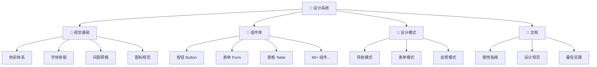
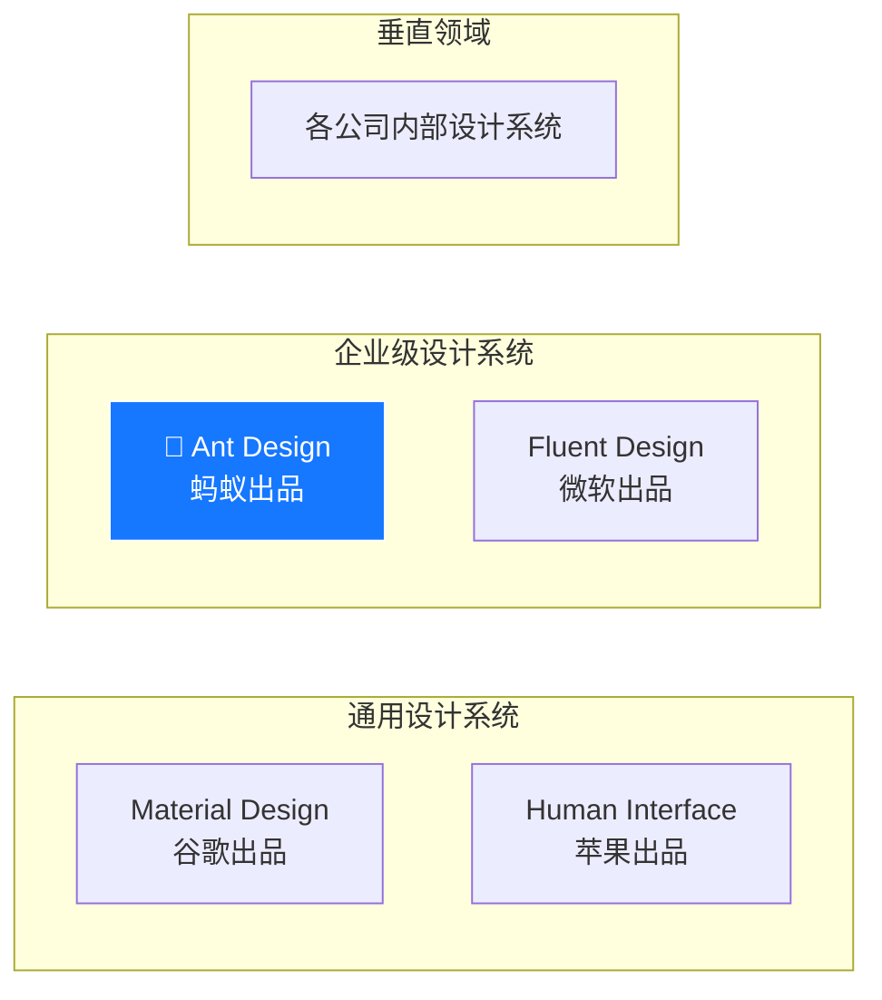
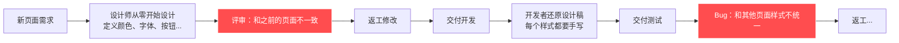
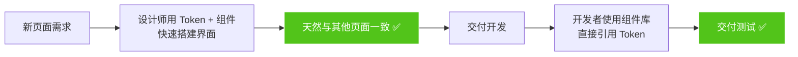

# 01 🌈 走进 Ant Design 设计体系

> 了解什么是设计系统、Ant Design 如何定义一套完整的视觉语言。

---

## 📌 本章目标

- 理解"设计系统"的概念及其价值
- 了解 Ant Design 在设计领域的定位
- 认识 Ant Design 的核心组成部分
- 初步感受设计系统如何提升团队效率

---

## 1.1 什么是设计系统？

### 生活中的类比

想象你走进任何一家**星巴克** ☕：

- 全球几万家门店，装修风格、菜单设计、杯子大小都是统一的
- 新开一家店不需要从零设计，按照"设计手册"来就行
- 顾客走进任何一家星巴克，都能立刻认出来

**设计系统就是产品界的"星巴克设计手册"。**

### 正式定义

> 设计系统（Design System）是一套**可复用的设计标准和组件集合**，
> 用来保证产品在不同页面、平台之间保持**视觉和交互的一致性**。

### 设计系统包含什么？



---

## 1.2 为什么需要设计系统？

### 没有设计系统的痛点 😰

| 问题 | 场景 |
|------|------|
| **一致性差** | A 设计师的按钮是方角，B 设计师的按钮是圆角 |
| **效率低** | 每个页面都从零开始设计相同的组件 |
| **沟通成本高** | 设计师说"用主色"，开发者不确定是哪个蓝色 |
| **品牌模糊** | 不同产品线看起来不像同一家公司的 |
| **迭代困难** | 改一个按钮样式要改 100 个地方 |

### 有了设计系统 ✨

| 解决 | 怎么做到的 |
|------|-----------|
| **一致** | 所有按钮都从组件库中获取，样式统一 |
| **高效** | 拖拽组件即可完成 80% 的界面设计 |
| **沟通精准** | "用 `colorPrimary`" → 所有人都知道是 `#1677ff` |
| **品牌清晰** | 修改主色 → 所有产品自动统一 |
| **快速迭代** | 改 Token → 全局生效 |

---

## 1.3 Ant Design 的定位

### 在设计系统中的位置



**Ant Design 的独特定位**：

| 维度 | Ant Design 的特点 |
|------|------------------|
| **目标场景** | 企业级中后台应用（管理系统、运营平台、数据平台） |
| **设计风格** | 简洁、专业、高信息密度 |
| **组件丰富度** | 80+ 组件，覆盖中后台几乎所有场景 |
| **主题定制** | Design Token 系统，支持一键换肤 |
| **国际化** | 75+ 语言，支持 RTL（从右到左）布局 |

### 核心数据

| 指标 | 数据 |
|------|------|
| ⭐ GitHub Stars | 90,000+ |
| 🏢 企业用户 | 蚂蚁、阿里、腾讯、字节等数千家 |
| 📦 组件数量 | 80+ |
| 🌍 支持语言 | 75+ |
| 🎨 设计变量 | 500+ Design Token |

---

## 1.4 Ant Design 的核心组成

作为设计师，你需要关注的核心部分：

### 🎨 设计语言

定义了视觉和交互的基本规则：

| 组成 | 内容 | 你需要了解的 |
|------|------|------------|
| **色彩** | 品牌色、功能色、中性色、色阶 | 什么场景用什么颜色 |
| **字体** | 字族、字号、字重、行高 | 标题和正文的排版规范 |
| **间距** | 内边距、外边距、间距网格 | 元素之间该留多少空间 |
| **圆角** | 不同层级的圆角大小 | 按钮、卡片、弹窗的圆角 |
| **阴影** | 浮层阴影层级 | 弹窗、下拉菜单的阴影 |
| **动效** | 过渡时间、缓动函数 | 展开收起、出现消失的动画 |

### 🧩 组件库

80+ 个预设计的 UI 组件，按功能分类：

```
📂 通用组件     → Button, Icon, Typography
📂 布局组件     → Layout, Grid, Space, Flex
📂 导航组件     → Menu, Breadcrumb, Tabs, Pagination
📂 数据录入     → Form, Input, Select, DatePicker, Upload
📂 数据展示     → Table, List, Card, Descriptions, Tree
📂 反馈组件     → Modal, Message, Notification, Alert, Progress
📂 其他组件     → Anchor, Tour, Watermark, QRCode
```

### 🔧 工具集

| 工具 | 作用 |
|------|------|
| **Design Token** | 设计变量管理（颜色、字体、间距...） |
| **主题定制** | 一键换肤能力 |
| **暗色模式** | 深色主题支持 |
| **紧凑模式** | 高密度信息展示 |

---

## 1.5 设计系统如何节省时间

### 没有设计系统



### 有设计系统



---

## 🤔 思考题

1. 你所在的团队/公司有设计系统吗？如果没有，遇到过哪些"没有设计系统"的痛点？
2. Ant Design 定位在"企业级中后台"，你认为它适合设计 C 端产品（如电商、社交 App）吗？为什么？
3. 设计系统中"设计语言"和"组件库"的关系是什么？能不能只有组件库没有设计语言？

---

> [返回目录](./README.md) | ➡️ [下一章：设计原则深度解读](./02-design-principles.md)
