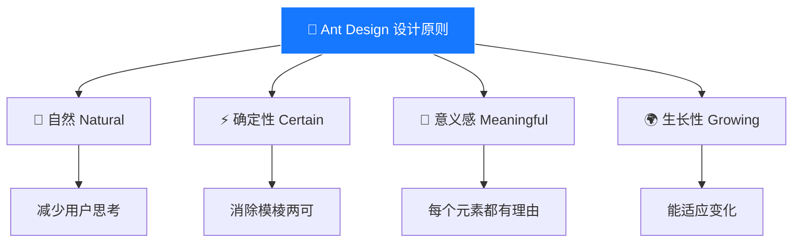
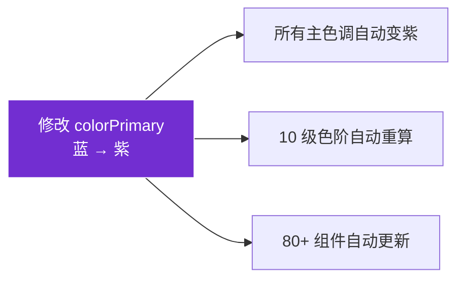

# 02 🧭 设计原则深度解读

> 理解 Ant Design 的四大设计原则，以及它们如何影响每一个组件的设计决策。

---

## 📌 本章目标

- 深入理解 Ant Design 的四大设计原则
- 学会用设计原则指导日常设计决策
- 通过实际组件案例感受原则的落地

---

## 2.1 设计原则概览

Ant Design 的四大设计原则不是空泛的口号，它们直接影响了组件的每一个设计细节：



---

## 2.2 🌊 自然（Natural）

### 核心思想

> 好的设计是用户**察觉不到的设计** — 一切都像预期的那样运作。

### 生活类比

你推一扇门 🚪：
- 如果门上有把手，你自然知道该"拉"
- 如果门上是一块平板，你自然知道该"推"
- **好的设计不需要贴"推/拉"的标签**

### 在 Ant Design 中的体现

#### 💧 波纹反馈（Wave Effect）

当你点击按钮时，会有一个从点击处扩散的波纹动画。

```
点击前：  [  按  钮  ]
点击时：  [  按 ●钮  ]  ← 波纹从点击位置扩散
点击后：  [  按  钮  ]  ← 波纹消失
```

**为什么这是"自然"的？**

> 就像你把手指按进水面 🌊 — 水波从接触点向外扩散。
> 这种反馈让用户知道"我的操作被接收了"，无需额外提示。

#### 📊 表格排序图标

```
未排序：  名字 ↕     ← 双箭头暗示"可排序"
升序：    名字 ↑     ← 向上箭头 = 从小到大
降序：    名字 ↓     ← 向下箭头 = 从大到小
```

用户不需要学习排序操作，图标自然地传达了状态。

#### 🔄 加载动画

Ant Design 的 Spin（加载中）组件使用旋转动画，而非进度条。

**为什么？** 旋转暗示"正在处理中"，这和日常生活中的经验一致 — 就像等待沙漏翻转、风车旋转。

---

## 2.3 ⚡ 确定性（Certain）

### 核心思想

> 每个操作、每个状态都要给用户**明确的预期**，不让用户猜。

### 生活类比

红绿灯 🚦：
- 红色 = 停
- 绿色 = 行
- 黄色 = 准备
- **没有任何歧义**

### 在 Ant Design 中的体现

#### 🎨 语义化色彩

| 颜色 | 含义 | 组件体现 |
|------|------|---------|
| 🔵 蓝色 `#1677ff` | 主要操作/信息 | 主按钮、链接、选中状态 |
| 🟢 绿色 `#52c41a` | 成功/通过 | 成功提示、通过状态 |
| 🟡 橙色 `#faad14` | 警告/注意 | 警告提示、需要关注 |
| 🔴 红色 `#ff4d4f` | 错误/危险 | 错误提示、危险操作 |

**设计规则**：颜色和含义的映射**永远不变**。用户一旦学会"红色=危险"，这个规则就会一直生效。

#### 🔘 按钮层级

```
视觉强度：  ████████  ██████  ────── ......  ______

类型：      Primary   Default  Dashed   Text    Link
含义：      主操作    次操作   添加     轻操作   跳转

规则：一个页面最多一个 Primary 按钮
```

**为什么有这个规则？** 如果满屏都是主按钮，用户就不知道"到底该点哪个" — 确定性被破坏了。

#### 📋 表单校验

```
正常状态：   [输入框_____________]
聚焦状态：   [输入框_____________]  ← 蓝色边框
错误状态：   [输入框_____________]  ← 红色边框
             ✕ 请输入有效的邮箱地址  ← 红色提示文字

成功状态：   [输入框_____________]  ← 绿色边框
             ✓ 格式正确             ← 绿色提示文字
```

每个状态都有明确的视觉区分，用户一眼就能看出"哪里错了"。

---

## 2.4 🎯 意义感（Meaningful）

### 核心思想

> 界面上的每一个元素都应该有存在的理由。如果删掉一个元素不影响功能，那它就不应该存在。

### 生活类比

好的厨房 🍳 — 每个工具都有独特用途：
- 大锅煮汤、小锅煎蛋、筷子夹菜、勺子舀汤
- 不会有两把一模一样的刀

### 在 Ant Design 中的体现

#### 🗂️ 组件不重复

| 需求 | 正确选择 | ❌ 错误选择 |
|------|---------|-----------|
| 简单提示 | `Tooltip`（悬浮即显） | 不用 Modal |
| 确认操作 | `Popconfirm`（气泡确认） | 不用 Modal |
| 复杂交互 | `Modal`（模态对话框） | 不用 Tooltip |
| 全局消息 | `Message`（顶部提示条） | 不用 Alert |
| 持久提示 | `Alert`（内嵌警告栏） | 不用 Message |

每个反馈组件有明确的使用场景，**不应该互相替代**。

#### 📐 间距有规律

Ant Design 的间距基于 **4px 网格**：

```
4px  → XS（最小间距）
8px  → SM（小间距）
12px → MD（中间距）
16px → 基础间距
24px → LG（大间距）
32px → XL（超大间距）
```

**为什么是 4 的倍数？** 因为屏幕像素是整数，4 的倍数在各种缩放比例下都能保持清晰（避免 0.5px 的模糊问题）。

---

## 2.5 🌍 生长性（Growing）

### 核心思想

> 设计系统不是一次性产品，它像生物一样**能进化、能适应变化**。

### 生活类比

乐高积木 🧱：
- 基础零件很简单（2×4 的砖块）
- 但可以拼出任何东西（房子、汽车、飞机）
- 新的零件（新组件）可以和旧零件完美兼容

### 在 Ant Design 中的体现

#### 🎨 Design Token 的扩展性

只改一个种子值（Seed Token），整个系统自动适应：



**这就是生长性** — 系统能适应"换品牌色"这样的变化，而不需要逐个修改组件。

#### 🔄 组件的可组合性

```
基础组件：   Button + Icon + Tooltip
组合使用：   [🔍] [📥] [⚙️]  ← 图标按钮工具栏

基础组件：   Input + Select + Button
组合使用：   [搜索... ▼] [🔍搜索]  ← 搜索栏

基础组件：   Table + Pagination + Filter + Sort
组合使用：   完整的数据管理表格  ← 企业级表格
```

像积木一样，简单组件可以**组合**成复杂界面。

---

## 2.6 设计决策检查清单

当你做设计决策时，可以用四大原则来检验：

| 检查项 | 原则 | 问自己 |
|--------|------|--------|
| 🌊 | 自然 | 用户能不能不看说明就会用？ |
| ⚡ | 确定性 | 用户能不能一眼看出当前状态和可操作项？ |
| 🎯 | 意义感 | 删掉这个元素，功能还完整吗？ |
| 🌍 | 生长性 | 如果需求变了，这个设计容易修改吗？ |

---

## 🤔 思考题

1. 找一个你常用的 App，分析它在"确定性"方面做得好不好（颜色是否语义化？状态是否清晰？）
2. 为什么 Ant Design 的间距系统选择 4px 为基础单位而不是 5px 或 10px？
3. "自然"原则中的"波纹效果"如果改成"颜色变深"会怎样？哪种更好？

---

> ⬅️ [上一章：走进设计体系](./01-introduction.md) | [返回目录](./README.md) | ➡️ [下一章：设计令牌](./03-design-tokens.md)
