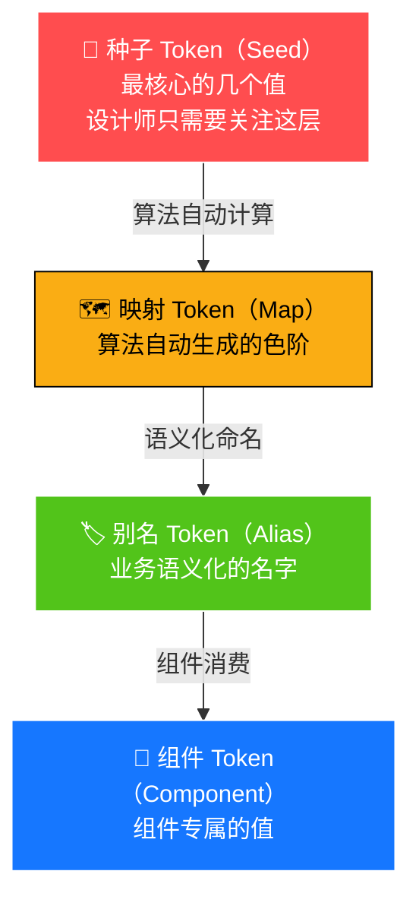

# 03 🎨 设计令牌（Design Token）— 设计师视角

> 用设计师能理解的方式，讲清楚 Design Token 是什么、怎么用。

---

## 📌 本章目标

- 理解 Design Token 的概念（不需要写代码）
- 掌握 Token 的层级关系
- 了解色彩、字体、间距的 Token 体系
- 学会用 Token 语言和开发者沟通

---

## 3.1 什么是 Design Token？

### 用设计师的语言解释

在 Figma 中，你可能会这样定义颜色：

```
品牌蓝      = #1677ff
品牌蓝-浅   = #e6f4ff
品牌蓝-深   = #0958d9
正文色      = rgba(0, 0, 0, 0.88)
辅助文字色   = rgba(0, 0, 0, 0.65)
```

**Design Token 就是这些设计变量的"正式名字"。**

不叫"品牌蓝"，而叫 `colorPrimary`。
不叫"正文色"，而叫 `colorText`。

有了统一的名字，设计师说 `colorPrimary`，开发者立刻知道是 `#1677ff`，不会理解错。

### Token vs 传统色值

```
❌ 传统沟通：
   设计师："这个按钮用蓝色"
   开发者："哪个蓝？#0066ff? #1677ff? #3399ff?"

✅ Token 沟通：
   设计师："这个按钮用 colorPrimary"
   开发者："明白，#1677ff"
```

---

## 3.2 Token 的四个层级

Token 像一棵树，从根部到叶子分为四层：



### 通俗理解

| 层级 | 类比 | 设计师需要关注 |
|------|------|-------------|
| 🌱 种子 Token | 调色板上的基础颜料 | ⭐⭐⭐ 最重要 |
| 🗺️ 映射 Token | 基础颜料调出的渐变色 | ⭐⭐ 需要了解 |
| 🏷️ 别名 Token | "标题用这个色""背景用那个色" | ⭐⭐ 需要了解 |
| 🧩 组件 Token | "按钮的阴影""输入框的边框" | ⭐ 偶尔用到 |

---

## 3.3 🎨 色彩 Token 体系

### 种子色（你需要定义的）

```
🔵 colorPrimary   = #1677ff    品牌主色
🟢 colorSuccess   = #52c41a    成功色
🟡 colorWarning   = #faad14    警告色
🔴 colorError     = #ff4d4f    错误色
ℹ️ colorInfo       = #1677ff    信息色
```

**只需要定义这 5 个颜色，系统会自动生成其他所有颜色。**

### 自动生成的色阶

以 `colorPrimary = #1677ff` 为例，算法会自动生成 10 级色阶：

```
色阶 1  ████ #e6f4ff   用途：极浅背景（选中行背景、标签背景）
色阶 2  ████ #bae0ff   用途：hover 背景
色阶 3  ████ #91caff   用途：边框色
色阶 4  ████ #69b1ff   用途：hover 边框
色阶 5  ████ #4096ff   用途：hover 主色
色阶 6  ████ #1677ff   用途：⬅️ 主色（种子值）
色阶 7  ████ #0958d9   用途：点击/激活色
色阶 8  ████ #003eb3   用途：深色文字
色阶 9  ████ #002c8c   用途：极深
色阶 10 ████ #001d66   用途：极深背景
```

### 中性色（灰色系）

```
colorText            rgba(0, 0, 0, 0.88)   正文/标题
colorTextSecondary   rgba(0, 0, 0, 0.65)   辅助文字
colorTextTertiary    rgba(0, 0, 0, 0.45)   占位符/禁用文字
colorTextQuaternary  rgba(0, 0, 0, 0.25)   极弱文字

colorBgContainer     #ffffff               容器背景
colorBgLayout        #f5f5f5               页面背景
colorBgElevated      #ffffff               浮层背景

colorBorder          #d9d9d9               边框
colorBorderSecondary #f0f0f0               次级边框
```

### 在 Figma 中的对应关系

| Design Token 名 | Figma 中的叫法 | 值 |
|-----------------|---------------|-----|
| `colorPrimary` | 全局色 / Primary | `#1677ff` |
| `colorText` | 文字/Body | `rgba(0,0,0,0.88)` |
| `colorTextSecondary` | 文字/Secondary | `rgba(0,0,0,0.65)` |
| `colorBgContainer` | 背景/Card | `#ffffff` |
| `colorBgLayout` | 背景/Page | `#f5f5f5` |
| `colorBorder` | 边框/Default | `#d9d9d9` |

---

## 3.4 📝 字体 Token 体系

### 字族

```
默认字族：-apple-system, BlinkMacSystemFont, 'Segoe UI', Roboto, ...
代码字族：'SFMono-Regular', Consolas, 'Liberation Mono', Menlo, ...
```

**为什么列这么多字族？** 这是"字族降级"策略 — 如果用户设备上没有第一个字体，就用第二个，以此类推。确保在所有设备上都有好的显示效果。

### 字号体系

```
fontSizeHeading1 = 38px   ← 一级标题（页面级标题）
fontSizeHeading2 = 30px   ← 二级标题（区块级标题）
fontSizeHeading3 = 24px   ← 三级标题
fontSizeHeading4 = 20px   ← 四级标题
fontSizeHeading5 = 16px   ← 五级标题

fontSizeLG       = 16px   ← 大号正文
fontSize         = 14px   ← 默认正文 ⬅️ 基础值
fontSizeSM       = 12px   ← 小号文字（注释、标签）
```

**为什么基础字号是 14px？**

> 12px 太小（在高分屏上看着费劲），16px 对于信息密度高的中后台又太大浪费空间。14px 是中后台场景下的最佳平衡点。

### 行高

```
lineHeight   = 1.5714   （14px 正文的行高 → 22px）
lineHeightLG = 1.5      （16px 的行高 → 24px）
lineHeightSM = 1.6667   （12px 的行高 → 20px）
```

---

## 3.5 📐 间距 Token 体系

### 基础单位：4px

所有间距都是 **4 的倍数**：

```
paddingXXS  =  4px    ← 1 单位
paddingXS   =  8px    ← 2 单位
paddingSM   = 12px    ← 3 单位
padding     = 16px    ← 4 单位（基础值）
paddingMD   = 20px    ← 5 单位
paddingLG   = 24px    ← 6 单位
paddingXL   = 32px    ← 8 单位
```

### 间距使用场景

```
4px  → 紧密间距（图标和文字之间）
8px  → 小间距（按钮内的 icon 和文字）
12px → 中间距（表单项内的元素）
16px → 标准间距（卡片内边距、列表项间距）
24px → 大间距（区块之间、卡片之间）
32px → 超大间距（页面级区域之间）
```

### 在设计稿中的体现

```
┌─────────────────────────────────┐
│          24px（paddingLG）         │ ← 卡片内边距
│  ┌──────────────────────────┐   │
│  │  标题文字                  │   │
│  └──────────────────────────┘   │
│          12px（paddingSM）        │ ← 标题和内容间距
│  ┌──────────────────────────┐   │
│  │  正文内容                  │   │
│  └──────────────────────────┘   │
│          16px（padding）          │ ← 内容和操作间距
│  [确定]  8px  [取消]             │ ← 按钮之间间距
│                                  │
└─────────────────────────────────┘
```

---

## 3.6 🔘 圆角 Token 体系

```
borderRadius     = 6px    ← 基础圆角（按钮、输入框）
borderRadiusSM   = 4px    ← 小圆角（小号组件）
borderRadiusLG   = 8px    ← 大圆角（卡片、弹窗）
borderRadiusXS   = 2px    ← 极小圆角（标签）
```

**设计原则**：
- 越重要的容器，圆角越大（弹窗 > 卡片 > 按钮 > 标签）
- 圆角大小和组件大小成正比

---

## 3.7 Token 速查表

### 设计师最常用的 Token

| Token 名称 | 类型 | 默认值 | 用途 |
|-----------|------|--------|------|
| `colorPrimary` | 颜色 | `#1677ff` | 品牌主色 |
| `colorSuccess` | 颜色 | `#52c41a` | 成功状态 |
| `colorWarning` | 颜色 | `#faad14` | 警告状态 |
| `colorError` | 颜色 | `#ff4d4f` | 错误/危险 |
| `colorText` | 颜色 | `rgba(0,0,0,0.88)` | 主要文字 |
| `colorTextSecondary` | 颜色 | `rgba(0,0,0,0.65)` | 辅助文字 |
| `colorBgContainer` | 颜色 | `#ffffff` | 容器背景 |
| `colorBorder` | 颜色 | `#d9d9d9` | 默认边框 |
| `fontSize` | 字号 | `14px` | 基础字号 |
| `borderRadius` | 圆角 | `6px` | 基础圆角 |
| `padding` | 间距 | `16px` | 基础内边距 |
| `controlHeight` | 高度 | `32px` | 控件高度 |

---

## 🤔 思考题

1. 如果你的公司品牌色是红色，需要改动几个 Token 来完成换肤？
2. 为什么文字色用 `rgba` 半透明值，而不是固定的 `#333333`？（提示：和暗色模式有关）
3. 间距体系为什么基于 4px 而不是 5px？在你的设计工具中试试 4px 网格对齐。

---

> ⬅️ [上一章：设计原则](./02-design-principles.md) | [返回目录](./README.md) | ➡️ [下一章：组件使用全景图](./04-component-guide.md)
