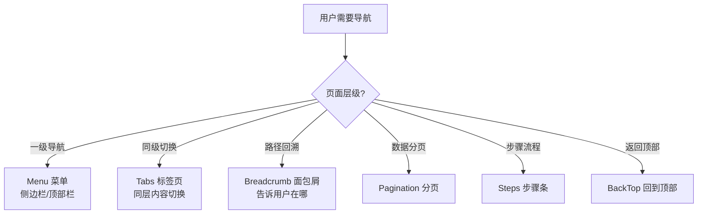
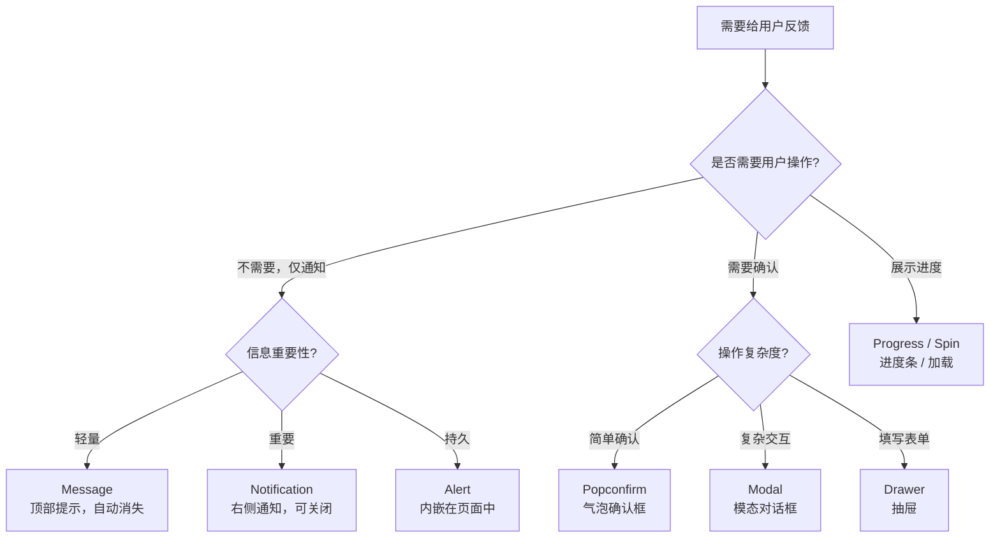

# 04 🧩 组件使用全景图

> 80+ 组件的分类、使用场景和设计选择指南。

---

## 📌 本章目标

- 了解 Ant Design 组件的完整分类
- 掌握每类组件的使用场景
- 学会在不同场景中选择正确的组件
- 理解组件之间的搭配关系

---

## 4.1 组件分类全景

```mermaid
graph TD
    AntD["🧩 Ant Design 80+ 组件"]
    
    AntD --> G["🔘 通用"]
    AntD --> L["📐 布局"]
    AntD --> N["🧭 导航"]
    AntD --> E["📝 数据录入"]
    AntD --> D["📊 数据展示"]
    AntD --> F["💬 反馈"]
    AntD --> O["🔧 其他"]
    
    G --> G1["Button 按钮"]
    G --> G2["Icon 图标"]
    G --> G3["Typography 排版"]
    
    L --> L1["Layout 布局"]
    L --> L2["Grid 栅格"]
    L --> L3["Space/Flex 间距"]
    
    N --> N1["Menu 菜单"]
    N --> N2["Tabs 标签页"]
    N --> N3["Breadcrumb 面包屑"]
    N --> N4["Pagination 分页"]
    
    E --> E1["Form 表单"]
    E --> E2["Input 输入框"]
    E --> E3["Select 选择器"]
    E --> E4["DatePicker 日期"]
    
    D --> D1["Table 表格"]
    D --> D2["Card 卡片"]
    D --> D3["List 列表"]
    
    F --> F1["Modal 对话框"]
    F --> F2["Message 消息"]
    F --> F3["Notification 通知"]
```



---

## 4.2 通用组件

### 🔘 Button 按钮

按钮是最基础的交互组件，Ant Design 提供了 5 种类型：

```
[███████]  Primary   主按钮 — 一个页面最多一个
[───────]  Default   默认按钮 — 最常用
[- - - -]  Dashed    虚线按钮 — 用于"添加"操作
 文字按钮   Text      文本按钮 — 最低调
 链接按钮   Link      链接按钮 — 跳转用途
```

**设计选择指南**：

| 场景 | 推荐类型 | 原因 |
|------|---------|------|
| 表单提交 | Primary | 引导用户完成核心操作 |
| 取消操作 | Default | 次要操作，不抢视觉 |
| 列表中"添加一行" | Dashed | 虚线暗示"可增加" |
| 表格操作列 | Link | 紧凑，不占空间 |
| 辅助功能按钮 | Text | 最低优先级 |

### 📝 Typography 排版

提供标题、段落、文本的标准排版：

```
Title Level 1  — 38px 页面标题
Title Level 2  — 30px 区块标题
Title Level 3  — 24px 组标题
Title Level 4  — 20px 子标题
Title Level 5  — 16px 小标题

Paragraph      — 14px 正文段落
Text           — 14px 行内文字
Link           — 14px 超链接
```

---

## 4.3 布局组件

### 📐 Layout 页面布局

企业级中后台的经典布局模式：

```
┌────────────────────────────────────┐
│              Header                │
├──────┬─────────────────────────────┤
│      │                             │
│      │                             │
│ Side │         Content             │
│  bar │                             │
│      │                             │
│      │                             │
├──────┴─────────────────────────────┤
│              Footer                │
└────────────────────────────────────┘
```

**Layout 组件**：`Layout` + `Header` + `Sider` + `Content` + `Footer`

### 📏 Grid 栅格系统

基于 24 列的栅格系统：

```
|<------------ 24 列 ------------>|

|<--- 6 --->|<------ 18 -------->|     侧边栏 + 内容区
|<-- 8 -->|<-- 8 -->|<-- 8 -->|         三等分
|<--- 12 --->|<--- 12 --->|            两等分
```

---

## 4.4 导航组件

### 🧭 何时用哪种导航？



---

## 4.5 数据录入组件

### 📝 选择正确的输入组件

| 需求 | 组件 | 说明 |
|------|------|------|
| 输入短文本 | **Input** | 用户名、邮箱等 |
| 输入长文本 | **Input.TextArea** | 评论、描述 |
| 输入数字 | **InputNumber** | 年龄、金额 |
| 输入密码 | **Input.Password** | 自动隐藏字符 |
| 从列表选一个 | **Select** | 城市、类型 |
| 从列表选多个 | **Select (多选)** | 标签、技能 |
| 级联选择 | **Cascader** | 省/市/区 |
| 选日期 | **DatePicker** | 生日、截止日 |
| 选时间 | **TimePicker** | 预约时间 |
| 选日期范围 | **RangePicker** | 报表时间段 |
| 选颜色 | **ColorPicker** | 主题色配置 |
| 是/否选择 | **Switch** | 开关类设置 |
| 单选 | **Radio** | 性别、类型 |
| 多选 | **Checkbox** | 兴趣、权限 |
| 范围选择 | **Slider** | 价格区间、音量 |
| 评分 | **Rate** | 满意度、评价 |
| 文件上传 | **Upload** | 头像、附件 |
| 提及某人 | **Mentions** | @某人 |
| 穿梭选择 | **Transfer** | 权限分配 |

### 表单组织方式

```
垂直表单（推荐，默认）：
┌────────────────┐
│ 标签            │
│ [输入框_______] │
│                 │
│ 标签            │
│ [输入框_______] │
└────────────────┘

水平表单（空间充足时）：
┌──────────────────────┐
│ 标签   [输入框______] │
│ 标签   [输入框______] │
└──────────────────────┘

行内表单（筛选器）：
[标签: 输入框] [标签: 选择器] [🔍 搜索]
```

---

## 4.6 数据展示组件

### 📊 选择正确的展示组件

| 数据特征 | 组件 | 说明 |
|---------|------|------|
| 多行多列，需排序筛选 | **Table** | 最强大的数据展示 |
| 图文混合列表 | **List** | 文章列表、评论 |
| 独立信息块 | **Card** | 商品卡片、项目卡片 |
| 关键指标 | **Statistic** | 销售额、用户数 |
| 详情字段 | **Descriptions** | 订单详情、用户信息 |
| 树形数据 | **Tree** | 部门结构、文件夹 |
| 时间序列 | **Timeline** | 操作日志、流程记录 |
| 状态标记 | **Tag** / **Badge** | 分类标签、消息数 |
| 图片展示 | **Image** | 支持预览、缩放 |
| 空状态 | **Empty** | 无数据时的占位 |

---

## 4.7 反馈组件

### 💬 选择正确的反馈方式



### 反馈组件对比

| 场景 | 组件 | 特点 |
|------|------|------|
| "操作成功" | **Message** | 轻量提示，3 秒消失 |
| "收到新消息" | **Notification** | 右上角通知，可点击 |
| "确定要删除吗？" | **Popconfirm** | 轻量确认，就近弹出 |
| "编辑用户信息" | **Modal** | 模态对话框，打断操作 |
| "查看详情" | **Drawer** | 侧边抽屉，不完全打断 |
| "表单有错误" | **Alert** | 持久显示在页面中 |
| "页面加载中" | **Spin** | 旋转加载图标 |
| "上传进度" | **Progress** | 百分比进度条 |

---

## 4.8 组件搭配指南

### 典型页面：列表管理页

```
┌─────────────────────────────────────────┐
│ Breadcrumb: 首页 / 用户管理 / 用户列表    │
├─────────────────────────────────────────┤
│ [搜索: Input] [状态: Select] [🔍 Button] │ ← 筛选区
├─────────────────────────────────────────┤
│ [+ 新增用户 Button]                       │ ← 操作区
├─────────────────────────────────────────┤
│ Table                                    │
│ 姓名 | 邮箱 | 状态(Tag) | 操作(Link)     │ ← 数据区
│ ...  | ...  | ...      | 编辑 删除       │
├─────────────────────────────────────────┤
│ Pagination: < 1 2 3 ... 10 >            │ ← 分页
└─────────────────────────────────────────┘
```

### 典型页面：表单提交页

```
┌─────────────────────────────────────┐
│ Steps: ① 基本信息  ② 详细信息  ③ 确认 │ ← 步骤条
├─────────────────────────────────────┤
│ Form                                 │
│   用户名    [Input__________]        │
│   部门      [Cascader: 请选择 ▼]     │
│   角色      ○ 管理员 ○ 普通用户       │ ← Radio
│   权限      □ 读取 □ 编辑 □ 删除      │ ← Checkbox
│   生效日期  [DatePicker 📅]           │
│   头像      [Upload: 点击上传]        │
│                                      │
│   [上一步 Button] [提交 Primary]      │
└─────────────────────────────────────┘
```

---

## 🤔 思考题

1. 当表格数据为空时，应该用什么组件来展示？为什么不能只显示"空白"？
2. "删除"操作应该用 Modal 还是 Popconfirm？考虑操作的**严重程度**来决定。
3. 如果一个筛选条件有 100+ 个选项，应该用 Select 还是 Cascader？为什么？

---

> ⬅️ [上一章：设计令牌](./03-design-tokens.md) | [返回目录](./README.md) | ➡️ [下一章：主题定制实战](./05-theme-customization.md)
