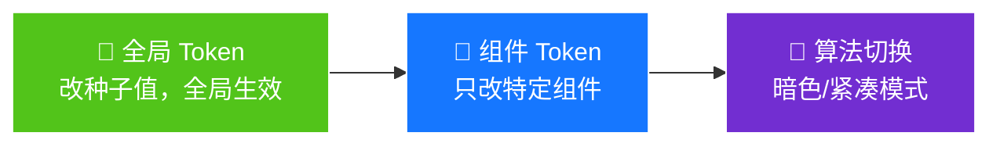
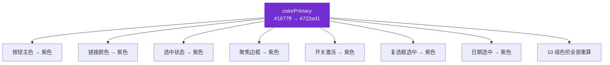
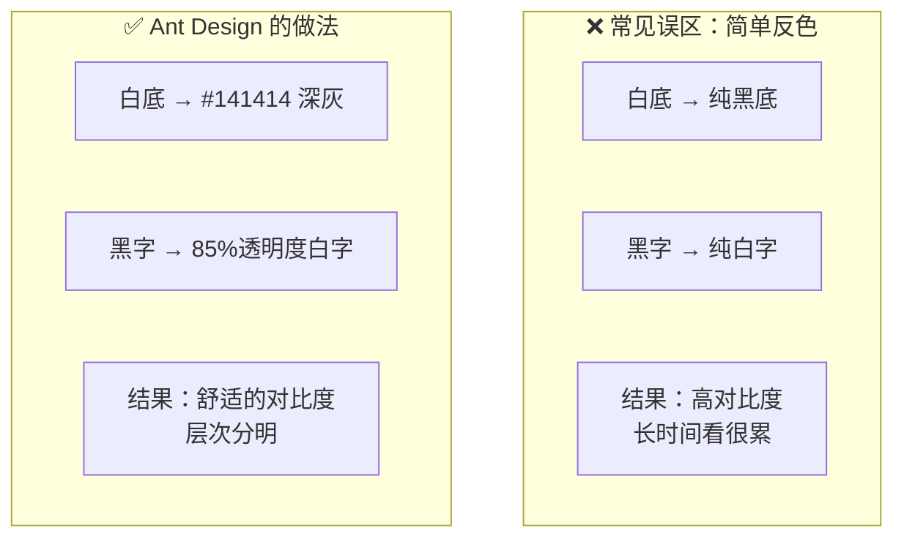
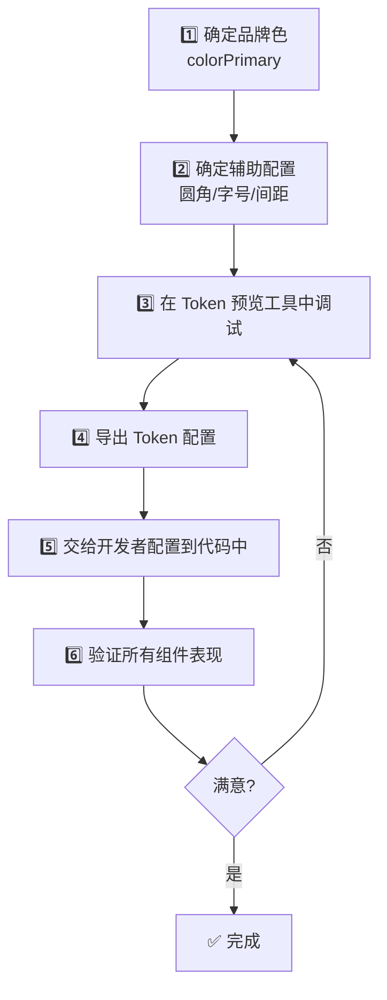

# 05 🎭 主题定制实战

> 学会用 Design Token 实现品牌换肤、暗色模式、紧凑模式等主题定制。

---

## 📌 本章目标

- 理解主题定制的三种方式
- 学会品牌色换肤的设计流程
- 掌握暗色模式的设计要点
- 了解紧凑模式的适用场景

---

## 5.1 主题定制概述

Ant Design v5 的主题定制基于 Design Token，有三个层次：



---

## 5.2 品牌色换肤

### 场景

你的公司品牌色是紫色 `#722ed1`，需要把 Ant Design 的默认蓝色全部换成紫色。

### 只需修改一个 Token

```
修改前：colorPrimary = #1677ff（蓝色）
修改后：colorPrimary = #722ed1（紫色）
```

### 自动变化的内容



### 换肤前后对比

```
蓝色主题（默认）：
  [████ 主按钮] [──── 默认按钮] [链接]
  [输入框 🔵聚焦] [🔵✓ 复选框]

紫色主题（品牌定制）：
  [████ 主按钮] [──── 默认按钮] [链接]
  [输入框 🟣聚焦] [🟣✓ 复选框]
```

### 完整品牌色定制方案

```
基础定制（只改 1 个 Token）：
  colorPrimary = #722ed1     ← 品牌紫

进阶定制（改 5 个 Token）：
  colorPrimary = #722ed1     ← 品牌紫
  colorSuccess = #52c41a     ← 成功绿（通常不改）
  colorWarning = #faad14     ← 警告橙（通常不改）
  colorError   = #ff4d4f     ← 错误红（通常不改）
  borderRadius = 8            ← 更大的圆角（品牌风格）

深度定制（改更多 Token）：
  fontSize     = 14 → 13      ← 更紧凑的字号
  controlHeight= 32 → 36      ← 更大的控件
  fontFamily   = 自定义字族    ← 品牌字体
```

---

## 5.3 暗色模式

### 为什么需要暗色模式？

| 原因 | 说明 |
|------|------|
| 👁️ **护眼** | 低光环境下减少屏幕刺眼 |
| 🔋 **省电** | OLED 屏幕黑色像素不发光 |
| 😎 **用户偏好** | 越来越多用户习惯暗色模式 |
| 🏢 **监控场景** | 数据大屏、运维监控通常用暗色 |

### 暗色模式不是"反色"



### 暗色模式的设计原则

**1. 背景层级**

```
亮色模式层级：
  页面背景  #f5f5f5  (最深)
  ↓
  卡片背景  #ffffff  (较浅)
  ↓
  弹窗背景  #ffffff  (最浅)

暗色模式层级（翻转！）：
  页面背景  #000000  (最深)
  ↓
  卡片背景  #141414  (较浅)
  ↓
  弹窗背景  #1f1f1f  (最浅)
```

**关键原则**：暗色模式中，越靠近用户的层越亮（像从深水中浮起来 🌊）。

**2. 文字透明度**

```
亮色模式：
  主要文字   rgba(0, 0, 0, 0.88)    88% 不透明
  辅助文字   rgba(0, 0, 0, 0.65)    65% 不透明
  占位文字   rgba(0, 0, 0, 0.45)    45% 不透明
  禁用文字   rgba(0, 0, 0, 0.25)    25% 不透明

暗色模式：
  主要文字   rgba(255, 255, 255, 0.85)   85% 不透明
  辅助文字   rgba(255, 255, 255, 0.65)   65% 不透明
  占位文字   rgba(255, 255, 255, 0.45)   45% 不透明
  禁用文字   rgba(255, 255, 255, 0.30)   30% 不透明
```

**为什么不用纯白 `#ffffff`？** 纯白文字在暗底上太刺眼，降低透明度让阅读更舒适。

**3. 颜色饱和度**

亮色模式下的高饱和颜色在暗底上会显得"刺眼"，暗色算法会**自动降低饱和度**。

```
亮色模式的主色：#1677ff （鲜艳蓝）
暗色模式的主色：#177ddc （柔和蓝）← 自动调整
```

---

## 5.4 紧凑模式

### 适用场景

| 场景 | 为什么需要紧凑模式 |
|------|-----------------|
| 数据密集型应用 | 一屏展示更多数据行 |
| 专业工具型界面 | 减少空白，提高效率 |
| 小屏幕设备 | 在有限空间内放更多内容 |
| 金融/交易系统 | 信息密度要求极高 |

### 紧凑模式的变化

```
默认模式               紧凑模式
controlHeight: 32px → 24px    控件高度减小
padding: 16px → 12px          间距收紧
fontSize: 14px → 14px         字号不变（保证可读性）
borderRadius: 6px → 4px       圆角微调
```

### 视觉对比

```
默认模式的表格行：
┌──────────────────────────────────────────┐
│  张三    │  设计部    │  Active   │  编辑  │  ← 行高 54px
├──────────────────────────────────────────┤
│  李四    │  开发部    │  Active   │  编辑  │
└──────────────────────────────────────────┘
  一屏显示 ~15 行

紧凑模式的表格行：
┌──────────────────────────────────────────┐
│ 张三  │ 设计部  │ Active │ 编辑 │          ← 行高 38px
├──────────────────────────────────────────┤
│ 李四  │ 开发部  │ Active │ 编辑 │
└──────────────────────────────────────────┘
  一屏显示 ~22 行（多显示 ~50%）
```

---

## 5.5 主题组合

### 可以组合使用多种主题

```
方案 1：默认亮色主题（适合大多数场景）
方案 2：暗色主题（适合监控大屏、夜间使用）
方案 3：紧凑主题（适合数据密集应用）
方案 4：暗色 + 紧凑（适合专业工具、交易系统）
方案 5：自定义品牌色 + 暗色（品牌定制 + 暗色支持）
```

### 同一页面不同区域用不同主题

```
┌──────────────────────────────────┐
│  Header（亮色主题）                │
├──────┬───────────────────────────┤
│      │                            │
│ 侧边 │     内容区（暗色主题）       │  ← 区域独立主题
│ 栏   │                            │
│(亮色)│                            │
│      │                            │
└──────┴───────────────────────────┘
```

---

## 5.6 设计师的主题定制流程



### 推荐工具

| 工具 | 用途 |
|------|------|
| [Ant Design 主题编辑器](https://ant.design/theme-editor-cn) | 在线调试 Token，实时预览效果 |
| Figma Ant Design 组件库 | 在设计稿中使用 Token 变量 |
| 浏览器开发者工具 | 检查实际渲染效果 |

---

## 🤔 思考题

1. 暗色模式中，为什么弹窗（Modal）的背景色比页面背景要浅？
2. 紧凑模式在减小间距的同时，为什么不减小字号？
3. 如果一个产品需要支持多个客户的品牌色（SaaS 场景），Design Token 如何帮助实现？

---

> ⬅️ [上一章：组件使用全景图](./04-component-guide.md) | [返回目录](./README.md) | ➡️ [下一章：设计资源与协作](./06-design-resources.md)
