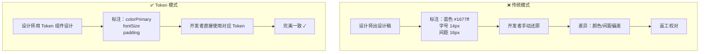
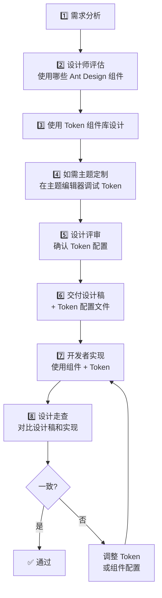

# 06 🤝 设计资源与协作

> 了解 Ant Design 提供的设计资源，以及设计师如何与开发者高效协作。

---

## 📌 本章目标

- 了解 Ant Design 提供的设计资源
- 掌握设计师与开发者的协作模式
- 学会用 Token 语言进行设计交付
- 建立高效的设计研发工作流

---

## 6.1 设计资源清单

### 🎨 设计工具资源

| 资源 | 类型 | 用途 |
|------|------|------|
| **Figma 组件库** | 设计文件 | 80+ 组件的 Figma 资源 |
| **Sketch 组件库** | 设计文件 | Sketch 版本组件资源 |
| **主题编辑器** | 在线工具 | 实时调试 Token，预览效果 |
| **Ant Design 图标库** | 图标资源 | 400+ 官方图标（线性/填充/双色） |
| **色彩生成器** | 在线工具 | 根据种子色生成 10 级色阶 |
| **Kitchen** | Sketch 插件 | 在 Sketch 中直接使用 Ant Design |

### 📖 文档资源

| 资源 | 说明 |
|------|------|
| [设计规范文档](https://ant.design/docs/spec/introduce-cn) | 设计原则、视觉规范 |
| [组件设计指南](https://ant.design/components/overview-cn) | 每个组件的设计用法 |
| [Token 参考](https://ant.design/docs/react/customize-theme-cn) | 完整的 Token 列表 |
| [暗色模式指南](https://ant.design/docs/react/customize-theme-cn#dark-theme) | 暗色主题设计建议 |
| [Ant Design 博客](https://ant.design/docs/blog/introduce-5.0-cn) | 设计理念和技术文章 |

---

## 6.2 设计师与开发者的协作模式

### 传统协作 vs Token 协作



### 协作语言：Design Token 对照表

设计师和开发者之间的"翻译词典"：

| 设计师说 | Token 名 | 开发者用 |
|---------|---------|---------|
| "用品牌色" | `colorPrimary` | `token.colorPrimary` |
| "用正文色" | `colorText` | `token.colorText` |
| "用辅助色" | `colorTextSecondary` | `token.colorTextSecondary` |
| "标准间距" | `padding` | `token.padding` |
| "基础圆角" | `borderRadius` | `token.borderRadius` |
| "卡片背景" | `colorBgContainer` | `token.colorBgContainer` |
| "页面背景" | `colorBgLayout` | `token.colorBgLayout` |
| "默认边框" | `colorBorder` | `token.colorBorder` |
| "控件高度" | `controlHeight` | `token.controlHeight` |
| "一级标题" | `fontSizeHeading1` | `token.fontSizeHeading1` |

---

## 6.3 设计交付规范

### 🎯 高效的设计标注方式

**传统标注**（❌ 容易不一致）：

```
按钮样式：
  背景色：#1677ff
  字体色：#ffffff
  字体大小：14px
  内边距：4px 15px
  圆角：6px
  高度：32px
```

**Token 标注**（✅ 精准对应）：

```
按钮样式：
  背景色：colorPrimary
  字体色：colorTextLightSolid
  字体大小：fontSize
  内边距：Component Token
  圆角：borderRadius
  高度：controlHeight
```

### 📋 设计交付清单

每次设计交付时，建议包含：

```
✅ 设计稿（Figma / Sketch 链接）
✅ 使用了哪些 Ant Design 组件
✅ 自定义的 Token 配置
   - colorPrimary: #xxx
   - borderRadius: xx
   - ...
✅ 特殊的组件定制说明
✅ 响应式断点标注
✅ 交互状态说明（hover / active / disabled）
✅ 暗色模式设计稿（如需要）
```

---

## 6.4 设计研发工作流

### 推荐工作流



### 设计走查要点

| 检查项 | 具体内容 |
|--------|---------|
| 🎨 颜色 | 主色调、功能色是否正确 |
| 📝 字体 | 字号、字重、行高是否符合规范 |
| 📐 间距 | 内边距、外边距是否符合 4px 网格 |
| 🔘 圆角 | 按钮、卡片、输入框圆角是否一致 |
| 🔄 状态 | hover、active、disabled 状态是否正确 |
| 📱 响应式 | 不同屏幕宽度的表现 |
| 🌙 暗色 | 暗色模式下的表现（如需要） |
| ♿ 可访问性 | 颜色对比度、焦点标识 |

---

## 6.5 给设计师的建议

### ✅ 推荐做法

| 建议 | 原因 |
|------|------|
| **优先使用 Ant Design 内置组件** | 减少定制开发，降低维护成本 |
| **用 Token 定义颜色，不硬编码** | 主题切换时自动适配 |
| **保持 4px 间距网格** | 与组件库保持一致 |
| **遵循组件使用规范** | Button 类型、反馈方式的选择 |
| **设计稿标注使用 Token 名** | 减少和开发者的沟通成本 |

### ❌ 避免的做法

| 避免 | 原因 |
|------|------|
| **不要自创组件替代内置组件** | 增加开发成本，且可能不一致 |
| **不要硬编码颜色值** | 换主题/暗色模式时会出问题 |
| **不要使用非 4 的倍数间距** | 可能在某些缩放比下出现模糊 |
| **不要忽略暗色模式** | 越来越多用户使用暗色模式 |
| **不要忽视可访问性** | 颜色对比度至少 4.5:1（WCAG AA） |

---

## 6.6 从设计到代码的桥梁

### Token 配置文件示例

设计师确定主题后，可以输出一个 Token 配置文件给开发者：

```
品牌主题配置
===========

种子 Token：
  colorPrimary:   #722ed1  (品牌紫)
  borderRadius:   8        (大圆角)
  fontSize:       14       (保持默认)
  controlHeight:  36       (控件略高)

组件定制：
  Button:
    borderRadius: 20       (按钮使用更大圆角)
  
  Card:
    borderRadius: 12       (卡片使用大圆角)

算法选择：
  默认使用亮色主题
  支持暗色模式切换
```

开发者收到后，直接转化为代码配置：

```tsx
<ConfigProvider
  theme={{
    token: {
      colorPrimary: '#722ed1',
      borderRadius: 8,
      controlHeight: 36,
    },
    components: {
      Button: { borderRadius: 20 },
      Card: { borderRadius: 12 },
    },
  }}
>
```

---

## 🎉 恭喜完成！

你已经完成了 Ant Design UI 设计师学习路径的全部内容！现在你应该能够：

- ✅ 理解 Ant Design 的设计体系和设计原则
- ✅ 掌握 Design Token 的体系和使用方法
- ✅ 在设计稿中正确使用 Ant Design 组件
- ✅ 实现品牌换肤和暗色模式定制
- ✅ 使用 Token 语言和开发者高效协作

---

## 🤔 思考题

1. 设计师应该如何向开发者交付自定义主题配置？
2. 设计走查时发现一个颜色不对，应该先检查 Token 配置还是代码实现？
3. 如果项目刚开始，设计师应该先确定哪些 Token？

---

> ⬅️ [上一章：主题定制实战](./05-theme-customization.md) | [返回目录](./README.md)
